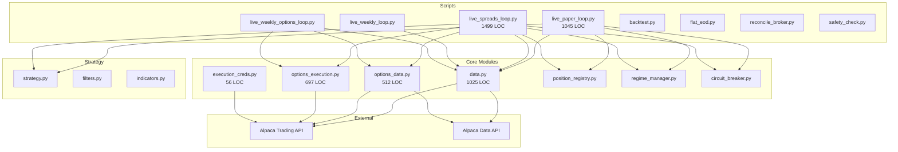
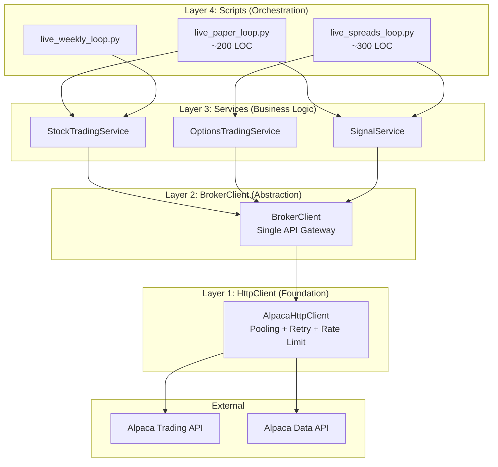

# RubberBand Trading Bot - Comprehensive Refactoring Plan

**Version:** 1.0
**Last Updated:** February 5, 2026
**Author:** Architecture Team

---

## Table of Contents

1. [Executive Summary](#1-executive-summary)
2. [Current Architecture Analysis](#2-current-architecture-analysis)
3. [Target Architecture](#3-target-architecture)
4. [Migration Strategy](#4-migration-strategy)
5. [Pros/Cons/Risks Analysis](#5-prosconsrisks-analysis)
6. [Interface Specifications](#6-interface-specifications)
7. [Testing Strategy](#7-testing-strategy)
8. [Success Metrics](#8-success-metrics)
9. [File Structure After Refactoring](#9-file-structure-after-refactoring)

---

## 1. Executive Summary

### Current State Overview

The RubberBand trading bot codebase has grown organically to support multiple trading strategies (15M stocks, options spreads, weekly options) across different timeframes. While functional, the architecture exhibits several anti-patterns that impede maintainability, testability, and future development:

- **16+ scripts** importing from **8+ modules** with inconsistent patterns
- **25+ direct Alpaca API calls** scattered across **4 files** (data.py, options_data.py, options_execution.py, execution_creds.py)
- **No abstraction layers** between business logic and broker API
- **God modules**: `data.py` (1,025 LOC), `live_spreads_loop.py` (1,499 LOC)
- **Duplicate credential resolution logic** in multiple files
- **Tight coupling** making broker migration or testing extremely difficult

### Target Architecture Vision

A clean, layered architecture following the pattern:

```
Scripts -> Services -> BrokerClient -> HttpClient -> Alpaca API
```

This provides:
- Single point of broker communication (BrokerClient)
- Reusable business logic (Services)
- Thin orchestration scripts (Live Loops)
- Easy testing at each layer via mocks
- Simple path to support additional brokers

### Expected Timeline and Effort

| Phase | Duration | Effort | Risk |
|-------|----------|--------|------|
| Phase 1: Foundation | Week 1 | Low | Minimal |
| Phase 2: BrokerClient | Week 2-3 | Medium | Low |
| Phase 3: Service Layer | Week 3-4 | High | Medium |
| Phase 4: Cleanup | Week 5 | Medium | Low |

**Total Estimated Time:** 5 weeks
**Parallel Development:** Can continue trading during migration

---

## 2. Current Architecture Analysis

### 2.1 Module Dependency Graph



### 2.2 Current Problems in Detail

#### Problem 1: Credential Resolution Duplication

**Found in 4 files with slightly different logic:**

| File | Function | Logic |
|------|----------|-------|
| `data.py` | `_resolve_key_secret()` | Checks `APCA_API_KEY_ID`, `ALPACA_KEY_ID` |
| `options_data.py` | `_resolve_creds()` | Checks `APCA_API_KEY_ID`, `ALPACA_KEY_ID` |
| `options_execution.py` | `_resolve_creds()` | Same as options_data.py |
| `execution_creds.py` | `configure_alpaca()` | Sets env vars, different aliases |
| `live_paper_loop.py` | `_broker_creds()` | Reads from config then env |

**Impact:** Inconsistent credential handling can cause silent failures when environment variables differ.

#### Problem 2: Direct API Calls Scattered

**Alpaca API calls by file:**

| File | Endpoint | Count |
|------|----------|-------|
| `data.py` | `/v2/clock` | 1 |
| `data.py` | `/v2/orders` | 3 |
| `data.py` | `/v2/positions` | 2 |
| `data.py` | `/v2/account` | 2 |
| `data.py` | `/v2/stocks/bars` | 1 |
| `data.py` | `/v2/stocks/{symbol}/quotes/latest` | 1 |
| `options_data.py` | `/v2/options/contracts` | 1 |
| `options_data.py` | `/v2/stocks/quotes/latest` | 1 |
| `options_data.py` | `/v1beta1/options/quotes/latest` | 1 |
| `options_data.py` | `/v1beta1/options/snapshots` | 1 |
| `options_execution.py` | `/v2/orders` | 3 |
| `options_execution.py` | `/v2/positions` | 2 |

**Total:** 19 unique API call sites across 3 files (not counting duplicates)

#### Problem 3: God Modules

**data.py (1,025 LOC) responsibilities:**
- Credential resolution
- Headers construction
- Market clock checking
- Position fetching
- Order management (get, cancel, submit)
- Fill calculation
- Kill switch logic
- Capital limit checks
- Bar fetching with pagination
- RTH filtering
- DataFrame construction
- Bracket order submission

**live_spreads_loop.py (1,499 LOC) responsibilities:**
- Argument parsing
- Config loading
- Signal detection
- Daily SMA calculation
- Spread entry logic
- Position management
- Spread P&L calculation
- Exit condition checking
- OCC symbol parsing
- Auditor log committing
- Registry reconciliation
- Main loop orchestration

#### Problem 4: No HTTP Abstraction

Each API call manually:
- Sets timeouts (inconsistent: 8, 10, 12, 15, 20 seconds)
- Handles errors differently
- Has no connection pooling
- Has no centralized retry logic (except `api_call_with_retry` in data.py, rarely used)
- Has no rate limiting

### 2.3 Current File Line Counts

```
File                                    Lines
---------------------------------------- -----
RubberBand/src/data.py                   1,025
RubberBand/scripts/live_spreads_loop.py  1,499
RubberBand/scripts/live_paper_loop.py    1,045
RubberBand/src/options_execution.py        697
RubberBand/src/options_data.py             512
RubberBand/src/position_registry.py        ~300
RubberBand/src/regime_manager.py           ~250
RubberBand/src/circuit_breaker.py          ~200
RubberBand/strategy.py                     ~400
```

---

## 3. Target Architecture

### 3.1 Architecture Diagram



### 3.2 Layer 1: HttpClient (Foundation)

**Purpose:** Provide a robust, unified HTTP interface with:
- Connection pooling via `requests.Session`
- Automatic retry with exponential backoff
- Rate limiting (429 handling)
- Consistent timeout management
- Request/response logging

**Location:** `RubberBand/src/core/http_client.py`

**Responsibilities:**
- Manage HTTP session lifecycle
- Apply consistent timeouts across all requests
- Implement retry logic for transient failures
- Handle rate limiting (HTTP 429)
- Log all requests for debugging

**Boundaries:**
- Does NOT know about Alpaca-specific endpoints
- Does NOT parse response bodies (returns raw dict/list)
- Does NOT handle authentication (receives headers)

### 3.3 Layer 2: BrokerClient (Alpaca Abstraction)

**Purpose:** Single entry point for ALL Alpaca operations. No other code should make direct API calls.

**Location:** `RubberBand/src/core/broker.py`

**Responsibilities:**
- Consolidate all Alpaca API interactions
- Handle credential resolution (single source of truth)
- Construct Alpaca-specific headers
- Map endpoints to methods
- Parse and validate responses
- Convert Alpaca data to internal models

**Boundaries:**
- Does NOT contain trading logic (that's Services)
- Does NOT make decisions (just executes commands)
- Does NOT know about strategies or signals

**Sub-components:**

| Component | Purpose |
|-----------|---------|
| `MarketDataClient` | Bars, quotes, snapshots |
| `TradingClient` | Orders, positions, account |
| `OptionsClient` | Options contracts, quotes, orders |

### 3.4 Layer 3: Services (Business Logic)

**Purpose:** Encapsulate reusable trading logic, independent of specific scripts.

**Location:** `RubberBand/src/services/`

#### StockTradingService

**Responsibilities:**
- Generate stock signals (RSI, Keltner, etc.)
- Calculate position sizing
- Submit bracket orders
- Manage open positions
- Apply filters (slope, trend, bearish bar)

**Dependencies:**
- BrokerClient (for data and orders)
- PositionRegistry (for tracking)
- RegimeManager (for dynamic config)

#### OptionsTradingService

**Responsibilities:**
- Generate options signals
- Select spread contracts (ATM/OTM)
- Submit spread orders
- Calculate spread P&L
- Manage spread positions

**Dependencies:**
- BrokerClient (for data and orders)
- PositionRegistry (for tracking)

#### SignalService

**Responsibilities:**
- Attach technical indicators
- Generate long/short signals
- Apply regime-based filters
- Validate signal quality

**Dependencies:**
- BrokerClient (for market data only)

### 3.5 Layer 4: Scripts (Orchestration)

**Purpose:** Thin wrappers that:
1. Parse command-line arguments
2. Load configuration
3. Initialize services
4. Run the main loop
5. Handle graceful shutdown

**Target LOC:** Each script should be ~200-300 lines maximum.

**Pattern:**
```python
def main():
    # 1. Parse args
    args = parse_args()
    config = load_config(args.config)

    # 2. Initialize services
    broker = BrokerClient.from_config(config)
    trading_service = StockTradingService(broker, config)

    # 3. Main loop
    while market_is_open():
        signals = trading_service.scan_for_signals(symbols)
        for signal in signals:
            trading_service.execute_signal(signal)
        trading_service.manage_positions()
        wait_for_next_scan()

    # 4. Cleanup
    trading_service.end_of_day()
```

---

## 4. Migration Strategy

### 4.1 Phase 1: Foundation (Week 1)

**Goal:** Create core infrastructure without breaking existing code.

#### Step 1.1: Create alpaca_creds.py

**Location:** `RubberBand/src/core/credentials.py`

**What it does:**
- Single source of truth for credential resolution
- Consolidates all env var checks
- Validates credentials on startup

**Files affected:** None (new file)

**Rollback plan:** Delete file, no other changes.

```python
# credentials.py - Interface Preview
class AlpacaCredentials:
    base_url: str
    api_key: str
    api_secret: str

    @classmethod
    def from_env(cls) -> "AlpacaCredentials": ...

    @classmethod
    def from_config(cls, config: dict) -> "AlpacaCredentials": ...

    def validate(self) -> None: ...  # Quick account check

    def get_headers(self) -> Dict[str, str]: ...
```

#### Step 1.2: Create http_client.py

**Location:** `RubberBand/src/core/http_client.py`

**What it does:**
- Unified HTTP handling with session pooling
- Retry logic with exponential backoff
- Rate limit handling
- Consistent timeout management

**Files affected:** None (new file)

**Rollback plan:** Delete file, no other changes.

#### Step 1.3: Verification

- All existing tests pass
- Bot runs normally in dry-run mode
- No changes to existing imports

### 4.2 Phase 2: BrokerClient (Week 2-3)

**Goal:** Create the BrokerClient facade and migrate internal calls.

#### Step 2.1: Create broker.py with Core Methods

**Location:** `RubberBand/src/core/broker.py`

**Methods to implement:**

| Method | Wraps |
|--------|-------|
| `get_account()` | `GET /v2/account` |
| `get_positions()` | `GET /v2/positions` |
| `is_market_open()` | `GET /v2/clock` |
| `get_bars()` | `GET /v2/stocks/bars` |
| `get_quote()` | `GET /v2/stocks/{symbol}/quotes/latest` |
| `submit_order()` | `POST /v2/orders` |
| `submit_bracket_order()` | `POST /v2/orders` (bracket) |
| `cancel_order()` | `DELETE /v2/orders/{id}` |
| `get_order()` | `GET /v2/orders/{id}` |
| `get_orders()` | `GET /v2/orders` |

#### Step 2.2: Migrate data.py Internals

**Strategy:** Make `data.py` functions call `BrokerClient` internally while maintaining their public interface.

```python
# Before (in data.py)
def get_positions(base_url, key, secret):
    r = requests.get(f"{base}/v2/positions", headers=..., timeout=12)
    ...

# After (in data.py)
def get_positions(base_url=None, key=None, secret=None):
    # Backward compatible wrapper
    broker = _get_broker_client(base_url, key, secret)
    return broker.get_positions()
```

**Files affected:**
- `data.py` (internal changes only)
- `broker.py` (new)

**Rollback plan:** Revert data.py changes, delete broker.py.

#### Step 2.3: Add Options Methods to BrokerClient

**Methods to implement:**

| Method | Wraps |
|--------|-------|
| `get_option_contracts()` | `GET /v2/options/contracts` |
| `get_option_quote()` | `GET /v1beta1/options/quotes/latest` |
| `get_option_snapshot()` | `GET /v1beta1/options/snapshots` |
| `submit_option_order()` | `POST /v2/orders` |
| `submit_spread_order()` | `POST /v2/orders` (mleg) |
| `get_option_positions()` | `GET /v2/positions` (filtered) |

#### Step 2.4: Migrate options_data.py and options_execution.py

**Strategy:** Same as data.py - internal migration with backward-compatible wrappers.

### 4.3 Phase 3: Service Layer (Week 3-4)

**Goal:** Extract business logic into reusable services.

#### Step 3.1: Create SignalService

**Extract from:**
- `strategy.py`: `attach_verifiers()`, `check_slope_filter()`, `check_bearish_bar_filter()`
- `live_paper_loop.py`: Signal detection loop logic

**New interface:**
```python
class SignalService:
    def __init__(self, broker: BrokerClient, config: dict):
        self.broker = broker
        self.config = config

    def fetch_and_prepare_bars(self, symbols: List[str]) -> Dict[str, pd.DataFrame]:
        """Fetch bars and attach indicators."""
        ...

    def scan_for_signals(
        self,
        bars_map: Dict[str, pd.DataFrame],
        regime_cfg: dict
    ) -> List[Signal]:
        """Apply all filters and return valid signals."""
        ...
```

#### Step 3.2: Create StockTradingService

**Extract from:**
- `live_paper_loop.py`: Order submission, position management, P&L tracking

**New interface:**
```python
class StockTradingService:
    def __init__(
        self,
        broker: BrokerClient,
        registry: PositionRegistry,
        config: dict
    ):
        ...

    def execute_signal(self, signal: Signal, dry_run: bool = False) -> OrderResult:
        """Submit bracket order for a signal."""
        ...

    def manage_positions(self) -> List[str]:
        """Check and close positions meeting exit criteria."""
        ...

    def get_daily_pnl(self) -> float:
        """Calculate realized P&L for today."""
        ...
```

#### Step 3.3: Create OptionsTradingService

**Extract from:**
- `live_spreads_loop.py`: Spread selection, entry, exit logic

**New interface:**
```python
class OptionsTradingService:
    def __init__(
        self,
        broker: BrokerClient,
        registry: PositionRegistry,
        config: dict
    ):
        ...

    def select_spread(self, signal: Signal, dte: int) -> Optional[SpreadContracts]:
        """Select ATM/OTM contracts for bull call spread."""
        ...

    def execute_spread_entry(
        self,
        spread: SpreadContracts,
        dry_run: bool = False
    ) -> OrderResult:
        """Submit spread order."""
        ...

    def manage_spreads(self) -> List[str]:
        """Check spread positions for TP/SL/time exits."""
        ...
```

#### Step 3.4: Refactor Live Loops to Use Services

**live_paper_loop.py transformation:**
```python
# Current: 1,045 LOC
# Target: ~200 LOC

def main():
    args = parse_args()
    config = load_config(args.config)

    broker = BrokerClient.from_config(config)
    signal_service = SignalService(broker, config)
    trading_service = StockTradingService(broker, registry, config)

    while market_open():
        # 1. Fetch data
        bars = signal_service.fetch_and_prepare_bars(symbols)

        # 2. Get signals
        signals = signal_service.scan_for_signals(bars, regime_cfg)

        # 3. Execute
        for signal in signals:
            trading_service.execute_signal(signal, dry_run=args.dry_run)

        # 4. Manage positions
        trading_service.manage_positions()

        wait_for_next_scan()
```

### 4.4 Phase 4: Cleanup (Week 5)

**Goal:** Remove deprecated code and split remaining god modules.

#### Step 4.1: Remove Deprecated Functions

**Delete from data.py:**
- `_resolve_key_secret()` (replaced by credentials.py)
- `_alpaca_headers()` (replaced by credentials.py)
- `_base_url_from_env()` (replaced by credentials.py)
- Direct `requests.get/post` calls (replaced by BrokerClient)

**Delete from options_data.py:**
- `_resolve_creds()` (replaced by credentials.py)
- `_headers()` (replaced by credentials.py)

**Delete from options_execution.py:**
- `_resolve_creds()` (replaced by credentials.py)
- `_headers()` (replaced by credentials.py)

#### Step 4.2: Split data.py into Focused Modules

**data.py (1,025 LOC) -> multiple files:**

| New File | Content | Est. LOC |
|----------|---------|----------|
| `core/broker.py` | BrokerClient (done in Phase 2) | ~400 |
| `data/bars.py` | Bar fetching, RTH filtering, DataFrame building | ~200 |
| `data/positions.py` | Position helpers, P&L calculation | ~100 |
| `data/orders.py` | Order helpers, fill fetching | ~100 |
| `data.py` | Re-exports for backward compatibility | ~50 |

#### Step 4.3: Update All Imports

**Strategy:**
1. Keep `data.py` as a re-export module for backward compatibility
2. Update internal imports to use new locations
3. Mark old locations as deprecated with warnings

```python
# data.py (after cleanup)
"""
DEPRECATED: Import from specific modules instead.
This file maintained for backward compatibility only.
"""
import warnings

from RubberBand.src.core.broker import BrokerClient
from RubberBand.src.data.bars import fetch_latest_bars, filter_rth
from RubberBand.src.data.positions import get_positions, calculate_realized_pnl
from RubberBand.src.data.orders import get_daily_fills, order_exists_today

# Emit deprecation warning
warnings.warn(
    "Importing from RubberBand.src.data is deprecated. "
    "Use RubberBand.src.core.broker or RubberBand.src.data.* instead.",
    DeprecationWarning,
    stacklevel=2
)
```

---

## 5. Pros/Cons/Risks Analysis

### 5.1 Pros

| Benefit | Description | Impact |
|---------|-------------|--------|
| **Reduced Coupling** | 16 scripts -> 1 BrokerClient for API calls | High |
| **Easier Testing** | Mock at BrokerClient or Service layer | High |
| **Broker Portability** | Only change BrokerClient to switch brokers | High |
| **Clearer Separation** | Each layer has single responsibility | Medium |
| **Reduced Duplication** | 4 credential functions -> 1 | Medium |
| **Consistent Error Handling** | Centralized retry/timeout logic | Medium |
| **Better Logging** | Single point for request/response logging | Medium |
| **Smaller Files** | 1,500 LOC -> ~300 LOC scripts | Medium |
| **Reusable Logic** | Services usable across scripts | Medium |

### 5.2 Cons

| Drawback | Description | Mitigation |
|----------|-------------|------------|
| **Development Overhead** | 5 weeks of refactoring time | Phased approach minimizes impact |
| **Learning Curve** | Team needs to understand new structure | Documentation + code reviews |
| **More Files** | ~15 new files to navigate | IDE navigation, clear naming |
| **Indirection** | More layers = more stack frames | Profile after, optimize if needed |
| **Potential Over-abstraction** | Risk of too many small classes | Keep interfaces simple |

### 5.3 Risks

| Risk | Probability | Impact | Mitigation |
|------|------------|--------|------------|
| **Breaking Production** | Medium | High | Feature flags, parallel implementations |
| **Introducing Bugs** | Medium | High | Comprehensive test coverage before migration |
| **Scope Creep** | Medium | Medium | Strict phase boundaries, defer enhancements |
| **Time Pressure** | Low | Medium | Maintain trading during migration |
| **Merge Conflicts** | Low | Low | Work on feature branch, frequent rebases |
| **Performance Regression** | Low | Medium | Benchmark before/after, connection pooling |

### 5.4 Risk Mitigations

#### Feature Flags for Gradual Rollout

```python
# In config.yaml
feature_flags:
  use_broker_client: false  # Toggle new BrokerClient
  use_service_layer: false  # Toggle new Services

# In code
if config.get("feature_flags", {}).get("use_broker_client", False):
    result = broker_client.get_positions()
else:
    result = legacy_get_positions(base_url, key, secret)
```

#### Parallel Implementations

During Phase 2-3, keep both old and new paths:
```python
def get_positions_hybrid(base_url, key, secret):
    """Compare old and new implementations for validation."""
    old_result = _legacy_get_positions(base_url, key, secret)
    new_result = broker_client.get_positions()

    if old_result != new_result:
        logger.warning(f"Position mismatch: old={old_result}, new={new_result}")

    return new_result  # Use new, but log discrepancies
```

#### Comprehensive Test Coverage Before Migration

**Minimum coverage before starting Phase 3:**
- BrokerClient: 95%
- HttpClient: 90%
- Credentials: 100%

---

## 6. Interface Specifications

### 6.1 AlpacaCredentials

```python
# RubberBand/src/core/credentials.py

from dataclasses import dataclass
from typing import Optional, Dict
import os


@dataclass(frozen=True)
class AlpacaCredentials:
    """
    Immutable container for Alpaca API credentials.

    Single source of truth for credential resolution.
    Supports both environment variables and config file values.
    """
    base_url: str
    api_key: str
    api_secret: str

    # Environment variable names to check (in priority order)
    ENV_BASE_URL_KEYS = ("APCA_API_BASE_URL", "APCA_BASE_URL", "ALPACA_BASE_URL")
    ENV_API_KEY_KEYS = ("APCA_API_KEY_ID", "ALPACA_KEY_ID", "ALPACA_KEY")
    ENV_SECRET_KEYS = ("APCA_API_SECRET_KEY", "ALPACA_SECRET_KEY", "ALPACA_SECRET")

    DEFAULT_PAPER_URL = "https://paper-api.alpaca.markets"

    @classmethod
    def from_env(cls) -> "AlpacaCredentials":
        """
        Create credentials from environment variables.

        Raises:
            ValueError: If required credentials are missing.
        """
        base_url = cls._get_env(cls.ENV_BASE_URL_KEYS, cls.DEFAULT_PAPER_URL)
        api_key = cls._get_env(cls.ENV_API_KEY_KEYS)
        api_secret = cls._get_env(cls.ENV_SECRET_KEYS)

        if not api_key or not api_secret:
            raise ValueError(
                "Alpaca credentials not found. Set APCA_API_KEY_ID and "
                "APCA_API_SECRET_KEY environment variables."
            )

        return cls(
            base_url=base_url.rstrip("/"),
            api_key=api_key.strip(),
            api_secret=api_secret.strip(),
        )

    @classmethod
    def from_config(cls, config: dict) -> "AlpacaCredentials":
        """
        Create credentials from config dict, falling back to env vars.

        Args:
            config: Dict with optional 'broker' section containing
                   'base_url', 'key', 'secret' keys.
        """
        broker = config.get("broker", {}) or {}

        base_url = (
            broker.get("base_url") or
            cls._get_env(cls.ENV_BASE_URL_KEYS, cls.DEFAULT_PAPER_URL)
        )
        api_key = broker.get("key") or cls._get_env(cls.ENV_API_KEY_KEYS)
        api_secret = broker.get("secret") or cls._get_env(cls.ENV_SECRET_KEYS)

        if not api_key or not api_secret:
            raise ValueError("Alpaca credentials not found in config or environment.")

        return cls(
            base_url=base_url.rstrip("/"),
            api_key=api_key.strip(),
            api_secret=api_secret.strip(),
        )

    @staticmethod
    def _get_env(keys: tuple, default: str = "") -> str:
        """Get first matching environment variable."""
        for key in keys:
            value = os.getenv(key)
            if value:
                return value
        return default

    def get_headers(self) -> Dict[str, str]:
        """Return Alpaca authentication headers."""
        return {
            "APCA-API-KEY-ID": self.api_key,
            "APCA-API-SECRET-KEY": self.api_secret,
            "Content-Type": "application/json",
        }

    def validate(self, timeout: int = 10) -> None:
        """
        Validate credentials by making a test API call.

        Raises:
            ValueError: If credentials are invalid.
            ConnectionError: If API is unreachable.
        """
        import requests

        url = f"{self.base_url}/v2/account"
        try:
            resp = requests.get(url, headers=self.get_headers(), timeout=timeout)
            if resp.status_code == 401:
                raise ValueError("Invalid Alpaca credentials (401 Unauthorized)")
            if resp.status_code == 403:
                raise ValueError("Forbidden - check API permissions (403)")
            resp.raise_for_status()
        except requests.RequestException as e:
            raise ConnectionError(f"Failed to validate credentials: {e}")

    @property
    def is_paper(self) -> bool:
        """Check if using paper trading endpoint."""
        return "paper" in self.base_url.lower()

    @property
    def data_url(self) -> str:
        """Return the data API URL (always data.alpaca.markets)."""
        return "https://data.alpaca.markets"
```

### 6.2 AlpacaHttpClient

```python
# RubberBand/src/core/http_client.py

from typing import Dict, Any, Optional, Callable
import time
import logging
import requests
from requests.adapters import HTTPAdapter
from urllib3.util.retry import Retry

logger = logging.getLogger(__name__)


class AlpacaHttpClient:
    """
    HTTP client with connection pooling, retries, and rate limit handling.

    Features:
    - Connection pooling via requests.Session
    - Automatic retry with exponential backoff
    - Rate limit (429) handling with Retry-After
    - Consistent timeout management
    - Request/response logging
    """

    DEFAULT_TIMEOUT = 15
    DEFAULT_MAX_RETRIES = 3
    DEFAULT_BACKOFF_FACTOR = 2.0

    RETRY_STATUS_CODES = (429, 500, 502, 503, 504)

    def __init__(
        self,
        creds: "AlpacaCredentials",
        timeout: int = DEFAULT_TIMEOUT,
        max_retries: int = DEFAULT_MAX_RETRIES,
        backoff_factor: float = DEFAULT_BACKOFF_FACTOR,
    ):
        """
        Initialize HTTP client.

        Args:
            creds: AlpacaCredentials instance
            timeout: Default timeout in seconds
            max_retries: Maximum retry attempts
            backoff_factor: Exponential backoff multiplier
        """
        self.creds = creds
        self.timeout = timeout
        self.max_retries = max_retries
        self.backoff_factor = backoff_factor

        # Create session with connection pooling
        self._session = self._create_session()

    def _create_session(self) -> requests.Session:
        """Create session with retry adapter."""
        session = requests.Session()

        # Configure retry strategy
        retry_strategy = Retry(
            total=self.max_retries,
            backoff_factor=self.backoff_factor,
            status_forcelist=self.RETRY_STATUS_CODES,
            allowed_methods=["GET", "POST", "DELETE"],
            raise_on_status=False,  # We handle status ourselves
        )

        adapter = HTTPAdapter(
            max_retries=retry_strategy,
            pool_connections=10,
            pool_maxsize=20,
        )

        session.mount("https://", adapter)
        session.mount("http://", adapter)

        return session

    def get(
        self,
        url: str,
        params: Optional[Dict[str, Any]] = None,
        timeout: Optional[int] = None,
    ) -> Dict[str, Any]:
        """
        Make GET request.

        Args:
            url: Full URL or path (relative to base_url)
            params: Query parameters
            timeout: Override default timeout

        Returns:
            Parsed JSON response

        Raises:
            requests.HTTPError: On 4xx/5xx responses
            requests.Timeout: On timeout
        """
        return self._request("GET", url, params=params, timeout=timeout)

    def post(
        self,
        url: str,
        json: Optional[Dict[str, Any]] = None,
        timeout: Optional[int] = None,
    ) -> Dict[str, Any]:
        """
        Make POST request.

        Args:
            url: Full URL or path (relative to base_url)
            json: JSON body
            timeout: Override default timeout

        Returns:
            Parsed JSON response

        Raises:
            requests.HTTPError: On 4xx/5xx responses
            requests.Timeout: On timeout
        """
        return self._request("POST", url, json=json, timeout=timeout)

    def delete(
        self,
        url: str,
        params: Optional[Dict[str, Any]] = None,
        timeout: Optional[int] = None,
    ) -> Dict[str, Any]:
        """
        Make DELETE request.

        Args:
            url: Full URL or path (relative to base_url)
            params: Query parameters
            timeout: Override default timeout

        Returns:
            Parsed JSON response (or empty dict for 204)

        Raises:
            requests.HTTPError: On 4xx/5xx responses
            requests.Timeout: On timeout
        """
        return self._request("DELETE", url, params=params, timeout=timeout)

    def _request(
        self,
        method: str,
        url: str,
        params: Optional[Dict[str, Any]] = None,
        json: Optional[Dict[str, Any]] = None,
        timeout: Optional[int] = None,
    ) -> Dict[str, Any]:
        """Internal request method with logging and error handling."""
        # Resolve full URL
        if not url.startswith("http"):
            url = f"{self.creds.base_url}/{url.lstrip('/')}"

        timeout = timeout or self.timeout

        logger.debug(f"HTTP {method} {url} params={params}")

        try:
            response = self._session.request(
                method=method,
                url=url,
                headers=self.creds.get_headers(),
                params=params,
                json=json,
                timeout=timeout,
            )

            # Handle rate limiting
            if response.status_code == 429:
                retry_after = int(response.headers.get("Retry-After", 60))
                logger.warning(f"Rate limited, waiting {retry_after}s")
                time.sleep(retry_after)
                return self._request(method, url, params, json, timeout)

            # Log response
            logger.debug(f"HTTP {response.status_code} {len(response.content)} bytes")

            # Handle no-content responses
            if response.status_code == 204:
                return {}

            # Raise for error status codes
            response.raise_for_status()

            return response.json() if response.content else {}

        except requests.Timeout:
            logger.error(f"Timeout after {timeout}s: {method} {url}")
            raise
        except requests.HTTPError as e:
            logger.error(f"HTTP error: {e.response.status_code} {e.response.text[:200]}")
            raise
        except Exception as e:
            logger.error(f"Request failed: {e}")
            raise

    def close(self) -> None:
        """Close the session and release connections."""
        self._session.close()

    def __enter__(self) -> "AlpacaHttpClient":
        return self

    def __exit__(self, *args) -> None:
        self.close()
```

### 6.3 BrokerClient

```python
# RubberBand/src/core/broker.py

from dataclasses import dataclass
from typing import Dict, List, Any, Optional, Tuple
from decimal import Decimal
import pandas as pd
from datetime import datetime, timedelta

from RubberBand.src.core.credentials import AlpacaCredentials
from RubberBand.src.core.http_client import AlpacaHttpClient


@dataclass
class OrderResult:
    """Result of an order submission."""
    success: bool
    order_id: Optional[str]
    status: str
    message: str
    filled_qty: int = 0
    filled_price: Optional[float] = None


class BrokerClient:
    """
    Single entry point for all Alpaca API operations.

    Consolidates all broker interactions into one class with:
    - Market data (bars, quotes)
    - Account operations (balance, positions)
    - Order management (submit, cancel, status)
    - Options operations (contracts, spreads)
    """

    def __init__(self, http_client: AlpacaHttpClient):
        """
        Initialize BrokerClient.

        Args:
            http_client: Configured AlpacaHttpClient instance
        """
        self._http = http_client
        self._data_url = "https://data.alpaca.markets"

    @classmethod
    def from_config(cls, config: dict) -> "BrokerClient":
        """Create BrokerClient from config dict."""
        creds = AlpacaCredentials.from_config(config)
        http = AlpacaHttpClient(creds)
        return cls(http)

    @classmethod
    def from_env(cls) -> "BrokerClient":
        """Create BrokerClient from environment variables."""
        creds = AlpacaCredentials.from_env()
        http = AlpacaHttpClient(creds)
        return cls(http)

    # ──────────────────────────────────────────────────────────────────────────
    # Market Data
    # ──────────────────────────────────────────────────────────────────────────

    def is_market_open(self) -> bool:
        """Check if market is currently open."""
        try:
            data = self._http.get("/v2/clock")
            return bool(data.get("is_open"))
        except Exception:
            return False

    def get_bars(
        self,
        symbols: List[str],
        timeframe: str = "15Min",
        start: Optional[datetime] = None,
        end: Optional[datetime] = None,
        limit: int = 10000,
        feed: str = "iex",
    ) -> Dict[str, pd.DataFrame]:
        """
        Fetch historical bars for multiple symbols.

        Args:
            symbols: List of ticker symbols
            timeframe: Bar timeframe (e.g., "15Min", "1Hour", "1Day")
            start: Start datetime (default: 30 days ago)
            end: End datetime (default: now)
            limit: Max bars per request
            feed: Data feed ("iex" or "sip")

        Returns:
            Dict mapping symbol to DataFrame with OHLCV data
        """
        if not symbols:
            return {}

        end = end or datetime.now()
        start = start or (end - timedelta(days=30))

        params = {
            "symbols": ",".join(symbols),
            "timeframe": timeframe,
            "start": start.strftime("%Y-%m-%dT%H:%M:%SZ"),
            "end": end.strftime("%Y-%m-%dT%H:%M:%SZ"),
            "limit": limit,
            "feed": feed,
        }

        result = {}
        url = f"{self._data_url}/v2/stocks/bars"

        # Handle pagination
        page_token = None
        collected: Dict[str, List[Dict]] = {s: [] for s in symbols}

        while True:
            if page_token:
                params["page_token"] = page_token

            data = self._http.get(url, params=params)
            bars = data.get("bars", {})

            # Handle both dict and list response shapes
            if isinstance(bars, dict):
                for sym, records in bars.items():
                    collected[sym.upper()].extend(records or [])
            elif isinstance(bars, list):
                for bar in bars:
                    sym = bar.get("S") or bar.get("symbol", "")
                    if sym:
                        collected[sym.upper()].append(bar)

            page_token = data.get("next_page_token")
            if not page_token:
                break

        # Convert to DataFrames
        for sym, records in collected.items():
            if records:
                result[sym] = self._bars_to_dataframe(records)

        return result

    def _bars_to_dataframe(self, records: List[Dict]) -> pd.DataFrame:
        """Convert bar records to DataFrame."""
        if not records:
            return pd.DataFrame()

        times, o, h, l, c, v = [], [], [], [], [], []
        for b in records:
            t = b.get("t") or b.get("time")
            times.append(pd.Timestamp(t).tz_convert("UTC"))
            o.append(float(b.get("o") or b.get("open", 0)))
            h.append(float(b.get("h") or b.get("high", 0)))
            l.append(float(b.get("l") or b.get("low", 0)))
            c.append(float(b.get("c") or b.get("close", 0)))
            v.append(float(b.get("v") or b.get("volume", 0)))

        df = pd.DataFrame(
            {"open": o, "high": h, "low": l, "close": c, "volume": v},
            index=pd.DatetimeIndex(times, tz="UTC"),
        )
        return df[~df.index.duplicated(keep="last")].sort_index()

    def get_quote(self, symbol: str) -> Dict[str, float]:
        """
        Get latest quote for a symbol.

        Returns:
            {"bid": float, "ask": float, "bid_size": int, "ask_size": int}
        """
        url = f"{self._data_url}/v2/stocks/{symbol}/quotes/latest"
        data = self._http.get(url)
        quote = data.get("quote", {})
        return {
            "bid": float(quote.get("bp", 0)),
            "ask": float(quote.get("ap", 0)),
            "bid_size": int(quote.get("bs", 0)),
            "ask_size": int(quote.get("as", 0)),
        }

    # ──────────────────────────────────────────────────────────────────────────
    # Account Operations
    # ──────────────────────────────────────────────────────────────────────────

    def get_account(self) -> Dict[str, Any]:
        """Get account details including equity and buying power."""
        return self._http.get("/v2/account")

    def get_positions(self) -> List[Dict[str, Any]]:
        """Get all open positions."""
        try:
            data = self._http.get("/v2/positions")
            return data if isinstance(data, list) else []
        except Exception:
            return []

    def get_position(self, symbol: str) -> Optional[Dict[str, Any]]:
        """Get position for a specific symbol."""
        try:
            return self._http.get(f"/v2/positions/{symbol}")
        except Exception:
            return None

    def close_position(self, symbol: str) -> Dict[str, Any]:
        """Close position for a symbol."""
        return self._http.delete(f"/v2/positions/{symbol}")

    def close_all_positions(self) -> Dict[str, Any]:
        """Close all positions."""
        return self._http.delete("/v2/positions")

    # ──────────────────────────────────────────────────────────────────────────
    # Order Operations
    # ──────────────────────────────────────────────────────────────────────────

    def submit_order(
        self,
        symbol: str,
        qty: int,
        side: str,
        order_type: str = "limit",
        limit_price: Optional[float] = None,
        time_in_force: str = "day",
        client_order_id: Optional[str] = None,
    ) -> OrderResult:
        """
        Submit a simple order.

        Args:
            symbol: Ticker symbol
            qty: Number of shares
            side: "buy" or "sell"
            order_type: "market", "limit", "stop", "stop_limit"
            limit_price: Required for limit orders
            time_in_force: "day", "gtc", "ioc", etc.
            client_order_id: Optional unique identifier

        Returns:
            OrderResult with success status
        """
        payload = {
            "symbol": symbol.upper(),
            "qty": int(qty),
            "side": side.lower(),
            "type": order_type.lower(),
            "time_in_force": time_in_force,
        }

        if limit_price is not None:
            payload["limit_price"] = round(float(limit_price), 2)

        if client_order_id:
            payload["client_order_id"] = client_order_id

        try:
            data = self._http.post("/v2/orders", json=payload)
            return OrderResult(
                success=True,
                order_id=data.get("id"),
                status=data.get("status", "submitted"),
                message="Order submitted",
            )
        except Exception as e:
            return OrderResult(
                success=False,
                order_id=None,
                status="rejected",
                message=str(e),
            )

    def submit_bracket_order(
        self,
        symbol: str,
        qty: int,
        side: str = "buy",
        limit_price: Optional[float] = None,
        take_profit_price: float = 0,
        stop_loss_price: float = 0,
        time_in_force: str = "gtc",
        client_order_id: Optional[str] = None,
    ) -> OrderResult:
        """
        Submit a bracket order (entry + take profit + stop loss).

        Args:
            symbol: Ticker symbol
            qty: Number of shares
            side: "buy" or "sell"
            limit_price: Entry limit price (or None for quote-based)
            take_profit_price: Take profit limit price
            stop_loss_price: Stop loss trigger price
            time_in_force: Order duration
            client_order_id: Optional unique identifier

        Returns:
            OrderResult with success status
        """
        # Get quote for limit price if not provided
        if limit_price is None:
            quote = self.get_quote(symbol)
            if side == "buy":
                limit_price = quote["ask"] * 1.01  # 1% buffer
            else:
                limit_price = quote["bid"] * 0.99

        payload = {
            "symbol": symbol.upper(),
            "qty": int(qty),
            "side": side.lower(),
            "type": "limit",
            "limit_price": round(float(limit_price), 2),
            "time_in_force": time_in_force,
            "order_class": "bracket",
            "take_profit": {"limit_price": round(float(take_profit_price), 2)},
            "stop_loss": {"stop_price": round(float(stop_loss_price), 2)},
        }

        if client_order_id:
            payload["client_order_id"] = client_order_id

        try:
            data = self._http.post("/v2/orders", json=payload)
            return OrderResult(
                success=True,
                order_id=data.get("id"),
                status=data.get("status", "submitted"),
                message="Bracket order submitted",
            )
        except Exception as e:
            return OrderResult(
                success=False,
                order_id=None,
                status="rejected",
                message=str(e),
            )

    def get_order(self, order_id: str) -> Optional[Dict[str, Any]]:
        """Get order by ID."""
        try:
            return self._http.get(f"/v2/orders/{order_id}")
        except Exception:
            return None

    def get_orders(
        self,
        status: str = "all",
        limit: int = 500,
        after: Optional[datetime] = None,
    ) -> List[Dict[str, Any]]:
        """Get orders with optional filters."""
        params = {"status": status, "limit": limit}
        if after:
            params["after"] = after.strftime("%Y-%m-%dT%H:%M:%SZ")

        data = self._http.get("/v2/orders", params=params)
        return data if isinstance(data, list) else []

    def cancel_order(self, order_id: str) -> bool:
        """Cancel order by ID."""
        try:
            self._http.delete(f"/v2/orders/{order_id}")
            return True
        except Exception:
            return False

    def cancel_all_orders(self) -> bool:
        """Cancel all open orders."""
        try:
            self._http.delete("/v2/orders")
            return True
        except Exception:
            return False

    # ──────────────────────────────────────────────────────────────────────────
    # Options Operations
    # ──────────────────────────────────────────────────────────────────────────

    def get_option_contracts(
        self,
        underlying: str,
        expiration_date: str,
        option_type: str = "call",
        limit: int = 100,
    ) -> List[Dict[str, Any]]:
        """
        Fetch option contracts for an underlying.

        Args:
            underlying: Stock symbol (e.g., "NVDA")
            expiration_date: YYYY-MM-DD format
            option_type: "call" or "put"
            limit: Max contracts to return

        Returns:
            List of contract dicts
        """
        params = {
            "underlying_symbols": underlying.upper(),
            "expiration_date": expiration_date,
            "type": option_type.lower(),
            "limit": limit,
        }

        try:
            data = self._http.get("/v2/options/contracts", params=params)
            return data.get("option_contracts", [])
        except Exception:
            return []

    def get_option_quote(self, option_symbol: str) -> Optional[Dict[str, float]]:
        """
        Get quote for an option contract.

        Returns:
            {"bid": float, "ask": float, "mid": float} or None
        """
        url = f"{self._data_url}/v1beta1/options/quotes/latest"
        params = {"symbols": option_symbol}

        try:
            data = self._http.get(url, params=params)
            quote = data.get("quotes", {}).get(option_symbol, {})
            bid = float(quote.get("bp", 0))
            ask = float(quote.get("ap", 0))
            if bid > 0 and ask > 0:
                return {"bid": bid, "ask": ask, "mid": (bid + ask) / 2}
            return None
        except Exception:
            return None

    def get_option_snapshot(self, option_symbol: str) -> Optional[Dict[str, Any]]:
        """
        Get snapshot (quote + greeks) for an option.

        Returns:
            Dict with bid, ask, mid, iv, delta, theta, gamma, vega
        """
        url = f"{self._data_url}/v1beta1/options/snapshots"
        params = {"symbols": option_symbol}

        try:
            data = self._http.get(url, params=params)
            snapshot = data.get("snapshots", {}).get(option_symbol, {})
            if not snapshot:
                return None

            quote = snapshot.get("latestQuote", {})
            greeks = snapshot.get("greeks", {})
            bid = float(quote.get("bp", 0))
            ask = float(quote.get("ap", 0))

            return {
                "bid": bid,
                "ask": ask,
                "mid": (bid + ask) / 2 if bid > 0 and ask > 0 else 0,
                "iv": float(greeks.get("implied_volatility", 0)),
                "delta": float(greeks.get("delta", 0)),
                "theta": float(greeks.get("theta", 0)),
                "gamma": float(greeks.get("gamma", 0)),
                "vega": float(greeks.get("vega", 0)),
            }
        except Exception:
            return None

    def get_option_positions(self) -> List[Dict[str, Any]]:
        """Get option positions (OCC symbols > 10 chars)."""
        positions = self.get_positions()
        return [p for p in positions if len(p.get("symbol", "")) > 10]

    def submit_spread_order(
        self,
        long_symbol: str,
        short_symbol: str,
        qty: int = 1,
        max_debit: Optional[float] = None,
        client_order_id: Optional[str] = None,
    ) -> OrderResult:
        """
        Submit a bull call spread as a multi-leg order.

        Args:
            long_symbol: OCC symbol for long leg (ATM call)
            short_symbol: OCC symbol for short leg (OTM call)
            qty: Number of spreads
            max_debit: Maximum net debit per spread
            client_order_id: Optional unique identifier

        Returns:
            OrderResult with success status
        """
        # Get quotes to determine debit
        long_quote = self.get_option_quote(long_symbol)
        short_quote = self.get_option_quote(short_symbol)

        if not long_quote or not short_quote:
            return OrderResult(
                success=False,
                order_id=None,
                status="rejected",
                message="Cannot get quotes for spread legs",
            )

        net_debit = long_quote["ask"] - short_quote["bid"]
        if net_debit <= 0:
            return OrderResult(
                success=False,
                order_id=None,
                status="rejected",
                message=f"Invalid spread pricing: debit={net_debit}",
            )

        if max_debit and net_debit > max_debit:
            return OrderResult(
                success=False,
                order_id=None,
                status="rejected",
                message=f"Spread debit {net_debit} exceeds max {max_debit}",
            )

        payload = {
            "qty": str(qty),
            "side": "buy",
            "type": "limit",
            "time_in_force": "day",
            "limit_price": str(round(net_debit, 2)),
            "order_class": "mleg",
            "legs": [
                {
                    "symbol": long_symbol,
                    "side": "buy",
                    "ratio_qty": "1",
                    "position_intent": "buy_to_open",
                },
                {
                    "symbol": short_symbol,
                    "side": "sell",
                    "ratio_qty": "1",
                    "position_intent": "sell_to_open",
                },
            ],
        }

        if client_order_id:
            payload["client_order_id"] = client_order_id

        try:
            data = self._http.post("/v2/orders", json=payload)
            return OrderResult(
                success=True,
                order_id=data.get("id"),
                status=data.get("status", "submitted"),
                message="Spread order submitted",
            )
        except Exception as e:
            return OrderResult(
                success=False,
                order_id=None,
                status="rejected",
                message=str(e),
            )

    def close_spread(
        self,
        long_symbol: str,
        short_symbol: str,
        qty: int = 1,
    ) -> OrderResult:
        """Close a spread position as a multi-leg order."""
        long_quote = self.get_option_quote(long_symbol)
        short_quote = self.get_option_quote(short_symbol)

        if not long_quote or not short_quote:
            return OrderResult(
                success=False,
                order_id=None,
                status="rejected",
                message="Cannot get quotes for spread legs",
            )

        # Credit = sell long at bid, buy short at ask
        net_credit = long_quote["bid"] - short_quote["ask"]
        limit_price = abs(net_credit)

        payload = {
            "qty": str(qty),
            "side": "sell",
            "type": "limit",
            "time_in_force": "day",
            "limit_price": str(round(limit_price, 2)),
            "order_class": "mleg",
            "legs": [
                {
                    "symbol": long_symbol,
                    "side": "sell",
                    "ratio_qty": "1",
                    "position_intent": "sell_to_close",
                },
                {
                    "symbol": short_symbol,
                    "side": "buy",
                    "ratio_qty": "1",
                    "position_intent": "buy_to_close",
                },
            ],
        }

        try:
            data = self._http.post("/v2/orders", json=payload)
            return OrderResult(
                success=True,
                order_id=data.get("id"),
                status=data.get("status", "submitted"),
                message="Spread close submitted",
            )
        except Exception as e:
            return OrderResult(
                success=False,
                order_id=None,
                status="rejected",
                message=str(e),
            )

    # ──────────────────────────────────────────────────────────────────────────
    # Lifecycle
    # ──────────────────────────────────────────────────────────────────────────

    def close(self) -> None:
        """Close HTTP client connections."""
        self._http.close()

    def __enter__(self) -> "BrokerClient":
        return self

    def __exit__(self, *args) -> None:
        self.close()
```

---

## 7. Testing Strategy

### 7.1 Unit Test Requirements

| Module | Min Coverage | Critical Paths |
|--------|--------------|----------------|
| `credentials.py` | 100% | All code paths |
| `http_client.py` | 90% | Retry logic, rate limiting |
| `broker.py` | 95% | All order methods |
| `StockTradingService` | 90% | Signal execution |
| `OptionsTradingService` | 90% | Spread entry/exit |

### 7.2 Unit Test Examples

```python
# tests/unit/test_broker.py

import pytest
from unittest.mock import Mock, patch
from RubberBand.src.core.broker import BrokerClient, OrderResult


class TestBrokerClient:
    """Tests for BrokerClient."""

    @pytest.fixture
    def mock_http(self):
        """Create mock HTTP client."""
        return Mock(spec=["get", "post", "delete", "creds"])

    @pytest.fixture
    def broker(self, mock_http):
        """Create BrokerClient with mock HTTP."""
        mock_http.creds = Mock(data_url="https://data.alpaca.markets")
        return BrokerClient(mock_http)

    def test_is_market_open_returns_true(self, broker, mock_http):
        """Market open when API returns is_open=True."""
        mock_http.get.return_value = {"is_open": True}

        result = broker.is_market_open()

        assert result is True
        mock_http.get.assert_called_once_with("/v2/clock")

    def test_is_market_open_returns_false_on_error(self, broker, mock_http):
        """Market open returns False on API error."""
        mock_http.get.side_effect = Exception("Connection failed")

        result = broker.is_market_open()

        assert result is False

    def test_submit_order_success(self, broker, mock_http):
        """Successful order submission."""
        mock_http.post.return_value = {
            "id": "order-123",
            "status": "accepted",
        }

        result = broker.submit_order(
            symbol="AAPL",
            qty=10,
            side="buy",
            order_type="limit",
            limit_price=150.00,
        )

        assert result.success is True
        assert result.order_id == "order-123"
        assert result.status == "accepted"

    def test_submit_order_rejected(self, broker, mock_http):
        """Order rejection returns error result."""
        mock_http.post.side_effect = Exception("Insufficient funds")

        result = broker.submit_order(
            symbol="AAPL",
            qty=10,
            side="buy",
        )

        assert result.success is False
        assert result.status == "rejected"
        assert "Insufficient funds" in result.message

    def test_get_positions_returns_list(self, broker, mock_http):
        """Get positions returns list."""
        mock_http.get.return_value = [
            {"symbol": "AAPL", "qty": "10"},
            {"symbol": "TSLA", "qty": "5"},
        ]

        result = broker.get_positions()

        assert len(result) == 2
        assert result[0]["symbol"] == "AAPL"

    def test_get_positions_returns_empty_on_error(self, broker, mock_http):
        """Get positions returns empty list on error."""
        mock_http.get.side_effect = Exception("Network error")

        result = broker.get_positions()

        assert result == []


class TestBrokerSpreadOrders:
    """Tests for spread order operations."""

    @pytest.fixture
    def broker(self):
        mock_http = Mock()
        mock_http.creds = Mock(data_url="https://data.alpaca.markets")
        return BrokerClient(mock_http)

    def test_submit_spread_validates_debit(self, broker):
        """Spread submission validates debit vs max."""
        broker.get_option_quote = Mock(side_effect=[
            {"bid": 1.0, "ask": 1.5, "mid": 1.25},  # Long
            {"bid": 0.3, "ask": 0.5, "mid": 0.4},   # Short
        ])

        # Debit = 1.5 - 0.3 = 1.2, max = 1.0
        result = broker.submit_spread_order(
            long_symbol="AAPL240315C00150000",
            short_symbol="AAPL240315C00155000",
            max_debit=1.0,
        )

        assert result.success is False
        assert "exceeds max" in result.message
```

### 7.3 Integration Tests

```python
# tests/integration/test_broker_integration.py

import pytest
from RubberBand.src.core.broker import BrokerClient


@pytest.fixture
def paper_broker():
    """Create real broker client for paper trading."""
    return BrokerClient.from_env()


@pytest.mark.integration
class TestBrokerIntegration:
    """Integration tests against paper trading API."""

    def test_can_fetch_account(self, paper_broker):
        """Can fetch account info from paper API."""
        account = paper_broker.get_account()

        assert "equity" in account
        assert "buying_power" in account

    def test_can_fetch_bars(self, paper_broker):
        """Can fetch historical bars."""
        bars = paper_broker.get_bars(["AAPL"], timeframe="1Day")

        assert "AAPL" in bars
        assert len(bars["AAPL"]) > 0
        assert "close" in bars["AAPL"].columns

    def test_market_clock(self, paper_broker):
        """Can check market status."""
        is_open = paper_broker.is_market_open()

        assert isinstance(is_open, bool)
```

### 7.4 Regression Test Checklist

Before each phase completion:

- [ ] All existing unit tests pass
- [ ] All existing integration tests pass
- [ ] Bot runs in dry-run mode for full trading day
- [ ] No errors in logs
- [ ] P&L calculation matches manual check
- [ ] Position registry syncs correctly

---

## 8. Success Metrics

### 8.1 Code Quality Metrics

| Metric | Current | Target | Measurement |
|--------|---------|--------|-------------|
| Lines in largest module | 1,499 LOC | <400 LOC | `wc -l` |
| Direct API call sites | 19 | 1 (BrokerClient) | grep count |
| Credential functions | 4 | 1 | grep count |
| Duplicate code lines | ~300 | <50 | `jsinspect` or `cpd` |
| Test coverage (core) | ~40% | 95% | pytest-cov |
| Test coverage (services) | ~30% | 90% | pytest-cov |

### 8.2 Operational Metrics

| Metric | Current | Target | Measurement |
|--------|---------|--------|-------------|
| Time to add new broker | Weeks | Days | Estimate |
| Time to fix API change | Hours | Minutes | Estimate |
| Mean time to diagnose issues | ~30 min | ~5 min | Logs + architecture |

### 8.3 Verification Steps

After Phase 4 completion:

1. **API Call Centralization**
   ```bash
   # Should return only broker.py
   grep -r "requests.get\|requests.post" RubberBand/src --include="*.py" | grep -v broker.py | grep -v http_client.py
   ```

2. **Credential Consolidation**
   ```bash
   # Should return only credentials.py
   grep -r "APCA_API_KEY_ID\|ALPACA_KEY" RubberBand/src --include="*.py" | grep -v credentials.py
   ```

3. **Module Size Check**
   ```bash
   wc -l RubberBand/src/*.py RubberBand/scripts/*.py | sort -n | tail -10
   # Largest file should be < 500 LOC
   ```

---

## 9. File Structure After Refactoring

```
RubberBand/
├── src/
│   ├── core/                          # NEW: Core infrastructure
│   │   ├── __init__.py
│   │   ├── credentials.py             # Phase 1: Unified credential handling
│   │   ├── http_client.py             # Phase 1: HTTP abstraction
│   │   └── broker.py                  # Phase 2: BrokerClient facade
│   │
│   ├── services/                      # NEW: Business logic services
│   │   ├── __init__.py
│   │   ├── signal_service.py          # Phase 3: Signal generation
│   │   ├── stock_trading.py           # Phase 3: Stock trading logic
│   │   └── options_trading.py         # Phase 3: Options trading logic
│   │
│   ├── data/                          # NEW: Focused data modules (Phase 4)
│   │   ├── __init__.py
│   │   ├── bars.py                    # Bar fetching, RTH filtering
│   │   ├── positions.py               # Position helpers
│   │   └── orders.py                  # Order/fill helpers
│   │
│   ├── data.py                        # DEPRECATED: Re-exports for compatibility
│   ├── options_data.py                # DEPRECATED: Delegates to broker
│   ├── options_execution.py           # DEPRECATED: Delegates to broker
│   │
│   ├── circuit_breaker.py             # Unchanged
│   ├── finance.py                     # Unchanged
│   ├── filters.py                     # Unchanged
│   ├── indicators.py                  # Unchanged
│   ├── options_trade_logger.py        # Unchanged
│   ├── position_registry.py           # Unchanged
│   ├── regime_manager.py              # Unchanged
│   ├── strategy.py                    # Unchanged
│   ├── ticker_health.py               # Unchanged
│   ├── trade_logger.py                # Unchanged
│   └── utils.py                       # Unchanged
│
├── scripts/
│   ├── live_paper_loop.py             # REFACTORED: ~200 LOC orchestration
│   ├── live_spreads_loop.py           # REFACTORED: ~300 LOC orchestration
│   ├── live_weekly_loop.py            # REFACTORED
│   ├── live_weekly_options_loop.py    # REFACTORED
│   ├── backtest.py                    # Minor updates
│   ├── flat_eod.py                    # Uses BrokerClient
│   └── ...                            # Other scripts
│
├── tests/
│   ├── unit/
│   │   ├── test_credentials.py        # NEW
│   │   ├── test_http_client.py        # NEW
│   │   ├── test_broker.py             # NEW
│   │   ├── test_stock_trading.py      # NEW
│   │   └── test_options_trading.py    # NEW
│   │
│   └── integration/
│       ├── test_broker_integration.py # NEW
│       └── test_e2e_paper.py          # NEW
│
├── config.yaml
├── strategy.py
└── __init__.py
```

### 9.2 Import Migration Guide

| Old Import | New Import |
|------------|------------|
| `from RubberBand.src.data import get_positions` | `from RubberBand.src.core.broker import BrokerClient` then `broker.get_positions()` |
| `from RubberBand.src.data import fetch_latest_bars` | `from RubberBand.src.core.broker import BrokerClient` then `broker.get_bars()` |
| `from RubberBand.src.options_data import get_option_quote` | `from RubberBand.src.core.broker import BrokerClient` then `broker.get_option_quote()` |
| `from RubberBand.src.options_execution import submit_spread_order` | `from RubberBand.src.core.broker import BrokerClient` then `broker.submit_spread_order()` |

---

## Appendix A: Decision Log

| Date | Decision | Rationale |
|------|----------|-----------|
| 2026-02-05 | Use BrokerClient class over functional approach | Better encapsulation, easier testing |
| 2026-02-05 | Keep backward-compatible re-exports | Minimize breaking changes |
| 2026-02-05 | Use `requests.Session` for pooling | Standard library, well-tested |
| 2026-02-05 | Services receive BrokerClient via constructor | Dependency injection for testing |

---

## Appendix B: References

- [Alpaca Trading API Documentation](https://alpaca.markets/docs/api-references/trading-api/)
- [Alpaca Market Data API](https://alpaca.markets/docs/api-references/market-data-api/)
- [CLAUDE.md - Trading Bot System Prompt](../CLAUDE.md)

---

*Document Version: 1.0*
*Last Updated: February 5, 2026*
