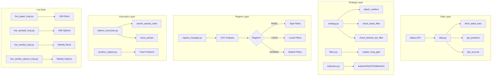

# RubberBandBot - Comprehensive System Handoff Document

> **Purpose**: Complete technical documentation for onboarding another agentic system to understand, maintain, and improve RubberBandBot.
>
> **Last Updated**: 2026-02-01

---

## Table of Contents
1. [Project Overview](#1-project-overview)
2. [System Architecture](#2-system-architecture)
3. [The Four Trading Bots](#3-the-four-trading-bots)
4. [Source Code Structure](#4-source-code-structure)
5. [Configuration Reference](#5-configuration-reference)
6. [GitHub Workflows (CI/CD)](#6-github-workflows)
7. [Commit History & Lessons Learned](#7-commit-history--lessons-learned)
8. [Known Bugs & Fixes](#8-known-bugs--fixes)
9. [Testing Infrastructure](#9-testing-infrastructure)
10. [Design Decisions & Rationale](#10-design-decisions--rationale)

---

## 1. Project Overview

### What is RubberBandBot?
A **mean reversion trading system** that buys oversold stocks/options when price stretches below the Keltner Channel lower band and RSI is oversold. The "rubber band" analogy: price snaps back to the mean after being stretched too far.

### Key Strategy Principles
- **Entry**: Price < Lower Keltner Channel AND RSI < threshold (25-45 depending on timeframe)
- **Exit**: Bracket orders with Take Profit at +50% and Stop Loss at -80% (configurable)
- **Risk Management**: Kill switch at -$100 daily, capital limits, position registry

### Repository Location
```
C:\Users\vraoo\GitHub\RubberBandBot\RubberBandBot\
```

---

## 2. System Architecture



### Data Flow
1. **Fetch Data** → Alpaca `fetch_latest_bars()` → Historical OHLCV
2. **Attach Indicators** → Keltner Channels, RSI, ATR, SMA, ADX
3. **Check Regime** → `RegimeManager.update()` → PANIC/CALM/NORMAL
4. **Generate Signals** → `long_signal = below_lower_band & rsi_oversold & filters`
5. **Apply Filters** → Slope filter, bearish bar filter, time window filter
6. **Execute** → Submit bracket orders via Alpaca

---

## 3. The Four Trading Bots

| Bot | File | Timeframe | Asset | Key Features |
|-----|------|-----------|-------|--------------|
| **15M Stock** | `live_paper_loop.py` | 15-minute | Stocks | RSI<25, slope filter, bearish bar filter |
| **15M Options** | `live_spreads_loop.py` | 15-minute | Bull Call Spreads | 3-DTE, $3 max debit, multi-leg orders |
| **Weekly Stock** | `live_weekly_loop.py` | 1-week | Stocks | RSI<45, 5% below SMA20 |
| **Weekly Options** | `live_weekly_options_loop.py` | 1-week | ITM Calls | 45-DTE, 0.65 delta, 100% TP / -50% SL |

### Bot Details

#### 15M Stock Bot (`live_paper_loop.py`)
- **Lines**: 937
- **BOT_TAG**: `15M_STK`
- **Entry Windows**: 09:45 - 15:45 ET
- **Max Notional**: $2000/trade
- **Scan Cadence**: Every 5 minutes
- **Key Imports**: `TradeLogger`, `PositionRegistry`, `RegimeManager`

#### 15M Options Bot (`live_spreads_loop.py`)  
- **Lines**: 1,310
- **BOT_TAG**: `15M_OPT`
- **Spread Config**:
  - Target DTE: 3 days
  - Spread Width: $5
  - Max Debit: $3.00
  - Contracts: 1
  - TP: +80%, SL: -80%
  - Bars Stop: 14 bars (~3.5 hours)
- **Auditor Integration**: Commits JSONL logs after each cycle

#### Weekly Stock Bot (`live_weekly_loop.py`)
- **Lines**: 444
- **BOT_TAG**: `WEEKLY_STK`
- **Entry Criteria**: RSI < 45 AND Price < 5% below SMA20
- **Uses**: `RegimeManager` for dynamic thresholds

#### Weekly Options Bot (`live_weekly_options_loop.py`)
- **Lines**: 690
- **BOT_TAG**: `WEEKLY_OPT`
- **Options Config**:
  - Target DTE: 45 days
  - Target Delta: 0.65 (ITM)
  - Max Premium: $500
  - TP: +100%, SL: -50%
  - Max Weeks Held: 9

---

## 4. Source Code Structure

### Core Source Files (`RubberBand/src/`)

| File | Lines | Purpose |
|------|-------|---------|
| `data.py` | 1,026 | Alpaca API wrapper, data fetching, kill switch, capital limits |
| `circuit_breaker.py` | 84 | PortfolioGuard (drawdown halt), ConnectivityGuard (API error halt) |
| `finance.py` | 49 | Decimal-based money arithmetic (avoids float precision issues) |
| `options_execution.py` | 697 | Options order submission, spread management |
| `options_trade_logger.py` | ~600 | Structured logging for options trades (JSONL) |
| `options_data.py` | ~500 | Options chain selection, ITM contract finder |
| `position_registry.py` | 450 | Track positions across bots, prevent duplicates, `reconcile_or_halt()` |
| `filters.py` | 231 | Gate logic: RSI, slope, ADX, EMA cross checks |
| `regime_manager.py` | 189 | VIXY-based market regime detection |
| `indicators.py` | ~200 | Technical indicators: Keltner, RSI, ATR, SMA, ADX |
| `ticker_health.py` | ~200 | Track per-ticker win/loss streaks |
| `trade_logger.py` | ~400 | Stock trade logging (JSONL + CSV) |
| `config_compat.py` | ~150 | Config validation and defaults |

### Scripts (`RubberBand/scripts/`)

#### Live Trading
| Script | Purpose |
|--------|---------|
| `live_paper_loop.py` | 15M stock trading bot |
| `live_spreads_loop.py` | 15M options spreads bot |
| `live_weekly_loop.py` | Weekly stock bot |
| `live_weekly_options_loop.py` | Weekly options bot |

#### Backtesting
| Script | Purpose |
|--------|---------|
| `backtest.py` | 15M stock backtest |
| `backtest_spreads.py` | 15M options spreads backtest |
| `backtest_weekly.py` | Weekly stock backtest |
| `backtest_weekly_options.py` | Weekly options backtest |

#### Utilities
| Script | Purpose |
|--------|---------|
| `scan_for_bot.py` | Unified ticker scanner |
| `auditor_bot.py` | Shadow ledger auditor |
| `reconcile_broker.py` | Broker position reconciliation |
| `safety_check.py` | Pre-market safety validations |
| `flat_eod.py` | End-of-day position flattening |

---

## 5. Configuration Reference

### Main Config (`RubberBand/config.yaml`)

```yaml
# Key Parameters (as of Jan 2026)
intervals: ["15m"]
rth_start: "09:30"
rth_end: "15:55"
entry_windows:
  - start: "09:45"
    end: "15:45"

# Indicators
keltner_length: 20
keltner_mult: 2.0
atr_length: 14
rsi_length: 14

# Risk
slope_threshold: -0.20  # 3-bar slope threshold

# Position Sizing
max_notional_per_trade: 2000
max_shares_per_trade: 10000

# Brackets
brackets:
  atr_mult_sl: 2.5
  stop_loss_pct: -0.80  # -80%
  take_profit_pct: 0.50 # +50%

# Filters
filters:
  rsi_oversold: 25
  min_dollar_vol: 1000000
  slope_threshold: -0.12
  dead_knife_filter: true
  bearish_bar_filter: true
```

### Weekly Config (`RubberBand/config_weekly.yaml`)
```yaml
timeframe: "1Week"
max_notional_per_trade: 2000
filters:
  rsi_oversold: 45
  mean_deviation_threshold: -5  # 5% below SMA20
brackets:
  atr_mult_sl: 2.0
  take_profit_r: 2.5
```

### Regime Configuration (in `regime_manager.py`)
```python
PANIC:  slope_threshold_pct=-0.20, dead_knife_filter=True,  weekly_rsi=40, weekly_mean_dev=-7%
CALM:   slope_threshold_pct=-0.08, dead_knife_filter=False, weekly_rsi=50, weekly_mean_dev=-3%
NORMAL: slope_threshold_pct=-0.12, dead_knife_filter=False, weekly_rsi=45, weekly_mean_dev=-5%
```

---

## 6. GitHub Workflows

### Active Workflows (`.github/workflows/`)

| Workflow | Schedule | Purpose |
|----------|----------|---------|
| `rubberband-live-loop-am.yml` | Market hours | 15M Stock Bot |
| `rubberband-options-spreads.yml` | Market hours | 15M Options Bot |
| `weekly-stock-live.yml` | Weekly | Weekly Stock Bot |
| `weekly-options-live.yml` | Weekly | Weekly Options Bot |
| `auditor-workflow.yml` | Market hours | Shadow Ledger Auditor |
| `daily-unified-scan.yml` | Daily | Ticker scanner |
| `preflight.yml` | Pre-market | Safety checks |
| `unit-tests.yml` | On push | Run pytest |

### Backtest Workflows
| Workflow | Purpose |
|----------|---------|
| `rubberband-backtest.yml` | Stock backtest |
| `15m-options-backtest.yml` | Options backtest |
| `weekly-backtest.yml` | Weekly stock backtest |
| `weekly-options-backtest.yml` | Weekly options backtest |

> [!WARNING]
> **Data Access**:
> 1. **GitHub Runners**: Cannot fetch IEX data reliably (0 trades).
> 2. **Local Backtests**: REQUIRE Alpaca API Keys (`APCA_API_KEY_ID`, `APCA_API_SECRET_KEY`) even for historical IEX data. If missing, they return 0 trades.
> **Recommendation**: Run backtests **locally** with keys configured.

---

## 7. Commit History & Lessons Learned

### Major Features (Chronological)

| Commit | Date | Feature | Impact |
|--------|------|---------|--------|
| `d26a7e2` | Dec | Deploy SMA-100 Strategy | Switched from SMA-20 to SMA-100 for trend filter |
| `86729c2` | Dec | Bearish Bar Filter (Stock) | Skip entries when close < open; +$3K, +15% win rate |
| `98b2d9a` | Dec | Bearish Bar Filter (Options) | Extended to options bot |
| `3702988` | Dec | Unified Scanner | Consolidated daily scanner, raised 15M_STK liquidity |
| `b59052a` | Jan 21 | Hybrid VIXY Regime Logic | Replaced $35/$55 thresholds with Bollinger Bands |
| `a8f3db53` | Feb 1 | GAP-008 Fix (Options) | Position reconciliation in 15M Options bot |
| `f0dc467d` | Feb 1 | GAP-008 Fix (Stock) | Position reconciliation in 15M Stock bot |
| `a776cc3a` | Feb 1 | GAP-008 Fix (Weekly) | Position reconciliation in Weekly Stock & Options bots |
| `e989da08` | Feb 1 | Test Fixes | Complete mocking for regime manager & audit tests |
| `f04708a0` | Feb 1 | Phase 7 Hardening | Circuit breakers (PortfolioGuard, ConnectivityGuard) + Decimal finance |

### Bug Fixes

| Commit | Bug | Fix | Root Cause |
|--------|-----|-----|------------|
| `0cdf76d` | `NameError: cfg is not defined` | Pass `cfg` to `try_spread_entry()` | Missing argument in function call |
| `b65f919` | Bearish filter ignored in backtest | Added config check in `simulate_mean_reversion()` | Backtest didn't read config flag |
| `17d36af` | Bearish filter broke options bot | Disabled for options bot | Filter logic incompatible with spreads |
| `74c622d` | Missing for-loop syntax error | Restored missing `for` | Merge conflict left incomplete code |
| `b65ba41` | Missing if-check | Restored if statement | Accidental deletion during edit |
| `b0652b2` | Syntax error from retry logic | Fixed duplication | Copy-paste error |
| `5f72ae4` | Auditor git safe.directory | Added safe.directory config | NETWORK SERVICE user ownership |

### Auditor Workflow Fixes
| Commit | Issue | Fix |
|--------|-------|-----|
| `3eeae73` | Workflow failures | Always exit 0 in commit step |
| `63fb782` | Unstaged changes error | Commit logs BEFORE pulling |
| `7f5719d` | UTF-16 encoding issues | Handle PowerShell encoding |
| `9773327` | Duplicate log events | Add line tracking |

---

## 8. Known Bugs & Fixes

### Critical Issues (Resolved)

1. **NameError in Options Bot** (Commit `0cdf76d`)
   - **Symptom**: `NameError: name 'cfg' is not defined` crashed bot
   - **Location**: `live_spreads_loop.py` → `try_spread_entry()` call
   - **Fix**: Pass `cfg=cfg` argument

2. **VIXY Data Missing** (Feed Issue)
   - **Symptom**: `RegimeManager` returned "Insufficient VIXY data"
   - **Cause**: `sip` feed requires subscription on paper accounts
   - **Fix**: Changed to `iex` feed in `regime_manager.py:74`

3. **Bearish Bar Filter Breaking Options** (Commit `17d36af`)
   - **Symptom**: Options bot stopped making trades
   - **Cause**: Filter checked bar structure not applicable to spreads
   - **Fix**: Set `bearish_bar_filter: false` in options config

### Active Issues

1. **Auditor Workflow Intermittent Failures**
   - Occurs when no new log lines exist to commit
   - Current workaround: `exit 0` always

2. **Weekly Bot Scanner Alignment**
   - Scanner may use different SMA than live bot
   - Commit `d8a6a9b` addressed partial mismatch

---

## 9. Testing Infrastructure

### Test Location
```
RubberBandBot/tests/
├── conftest.py              # Pytest fixtures (25-row VIXY mock DataFrames)
├── test_regime_scenarios.py # VIXY regime unit tests (5 tests)
├── test_audit_cutoff.py     # Auditor cutoff time tests (3 tests)
├── test_resilience.py       # Circuit breaker tests
├── unit/
│   ├── test_options_execution.py  # Options order tests
│   ├── test_signals.py            # Signal generation tests
│   └── test_spread_pricing.py     # Spread pricing tests
└── integration/
    └── (future tests)
```

### Test Status (Feb 2026)
- **Total Tests**: 45
- **Passing**: 45 (100%)
- **Test Fixes Applied**: Regime manager fixtures now use proper 25-row DataFrames with volume/datetime index

### Key Tests

#### `test_regime_scenarios.py` (5 Tests)
| Test | Scenario | Expected Regime |
|------|----------|-----------------|
| `test_panic_spike` | VIXY +10%, 2x volume | PANIC |
| `test_fake_out` | VIXY +10%, low volume | NORMAL (trap) |
| `test_creep` | Price above SMA, no spike | NORMAL |
| `test_recovery` | 3 days below SMA | CALM |
| `test_total_calm` | Sustained low volatility | CALM |

### Running Tests
```bash
# All tests
python -m pytest tests/ -v

# Specific test file
python -m pytest tests/test_regime_scenarios.py -v
```

---

## 10. Design Decisions & Rationale

### Why Keltner Channels?
- More responsive to volatility than Bollinger Bands (uses ATR vs. std dev)
- Better for mean reversion: captures "stretched" price moves

### Why RSI < 25 for 15M, RSI < 45 for Weekly?
- **15M**: Extreme oversold catches intraday panics (quick snaps)
- **Weekly**: Less extreme because weekly RSI rarely drops below 30

### Why Bearish Bar Filter?
- Backtest showed entries on bearish bars (close < open) had 15% lower win rate
- Waiting for bullish confirmation adds +$3K in backtest

### Why Hybrid VIXY Regime (Jan 2026)?
- **Problem**: VIXY decays over time and reverse splits → static $35/$55 thresholds become meaningless
- **Solution**: Use Bollinger Bands (relative to 20-day SMA) + Volume confirmation
- **Result**: Adapts to any VIXY price level automatically

### Why 3-Day Hysteresis for CALM?
- **Problem**: Single day below SMA triggered CALM → premature risk-on
- **Solution**: Require 3 consecutive days below SMA
- **Result**: More stable regime transitions

### Why IEX Feed?
- **SIP**: Requires subscription, often blocked on paper accounts
- **IEX**: Free, sufficient for 15-minute data
- **Trade-off**: Slightly lower volume reported

### Why -80% Stop Loss for Options?
- **Problem**: 3-DTE options can have 50%+ daily swings
- **Original -50% SL**: Stopped out too often before recovery
- **New -80% SL**: Holds through volatility, relies more on time stop

---

## Environment Variables

```bash
# Required for Alpaca API
APCA_API_KEY_ID=your_key
APCA_API_SECRET_KEY=your_secret

# Alternative names (also checked)
ALPACA_KEY_ID
ALPACA_SECRET_KEY
```

---

## Quick Start for New Agent

1. **Understand the Strategy**: Mean reversion = buy oversold, sell at mean
2. **Key Files to Study First**:
   - `strategy.py` (169 lines) - Signal generation logic
   - `regime_manager.py` (189 lines) - Market environment detection
   - `config.yaml` (124 lines) - All configurable parameters
3. **Run Tests**: `python -m pytest tests/ -v`
4. **Backtest a Change**: `python RubberBand/scripts/backtest.py --tickers AAPL --days 30`
5. **Check Regime**: `python check_regime_date.py` (tests VIXY logic)

---

## File Counts Summary

| Directory | Files | Purpose |
|-----------|-------|---------|
| `RubberBand/src/` | 16 | Core modules |
| `RubberBand/scripts/` | 42 | Live bots, backtests, utilities |
| `.github/workflows/` | 17 | CI/CD workflows |
| `tests/` | 4 + subdirs | Unit and integration tests |
| Root | ~300 | Analysis scripts, logs, results |

---

*Document generated by Antigravity for handoff to external agentic system.*

---

## 8. Recent Incident Analysis (Jan 29-30)
**User Report**: "Bots failed last couple of days."
**Investigation**:
- **Jan 29 (Partial Failure)**: `15M_OPT` Log shows `insufficient qty` error closing `ACN`.
    - **Root Cause**: GAP-008 (Registry Desync). Bot tried to close a position it thought it had, but Broker said 0 available.
    - **Status**: **FIXED** (Feb 1, 2026) - See GAP-008 Fix below.
- **Jan 30 (Total Failure)**: No logs found. Bot failed to start.
    - **Root Cause**: Likely infrastructure/env issue (e.g. API key, Runner crash) preventing startup. `ConnectivityGuard` (Phase 7) effectively prevents this from happening *silently* in the future (it logs and halts).

---

## GAP-008 Fix: Position Reconciliation (Feb 1, 2026)

### Problem
The `sync_with_alpaca()` method silently removed orphaned positions from registry without alerting. Later, `close_spread()` would attempt to close these "phantom" positions, causing `insufficient qty` errors.

### Solution: `reconcile_or_halt()` Pattern

Added new method to `position_registry.py`:
```python
def reconcile_or_halt(
    self,
    alpaca_positions: List[Dict[str, Any]],
    auto_clean: bool = False,
) -> Tuple[bool, List[str], List[str]]:
    """
    Reconcile registry with broker positions WITHOUT silent cleanup.
    Returns:
        Tuple of (is_clean, registry_orphans, broker_untracked)
    """
```

### Implementation (All 4 Bots)
1. **Startup Reconciliation**: Each bot now calls `reconcile_or_halt()` at startup instead of `sync_with_alpaca()`. If mismatches found, logs CRITICAL and auto-cleans orphans (with explicit logging).

2. **Pre-Close Verification** (Options bots): Before attempting `close_spread()`, verify position exists in both registry AND broker state.

### Commits
- `a8f3db53`: fix(GAP-008) for 15M Options bot (`live_spreads_loop.py`)
- `f0dc467d`: fix(GAP-008) for 15M Stock bot (`live_paper_loop.py`)
- `a776cc3a`: fix(GAP-008) for Weekly bots (`live_weekly_loop.py`, `live_weekly_options_loop.py`)

### Deprecation
`sync_with_alpaca()` now logs a deprecation warning. Use `reconcile_or_halt()` for explicit control over cleanup behavior.

---

## Phase 7 Hardening: Circuit Breakers (Feb 1, 2026)

### New Modules

**`circuit_breaker.py`** - Safety halt mechanisms:
```python
PortfolioGuard(state_file, max_drawdown_pct=0.10)
# Halts trading if portfolio drawdown exceeds 10%
# Persistent state survives restarts
# Requires manual reset after triggering

ConnectivityGuard(max_errors=5)
# Halts after 5 consecutive API errors
# In-memory counter (resets on restart)
# Prevents infinite retry loops
```

**`finance.py`** - Decimal-based money arithmetic:
```python
to_decimal(value)      # Safe conversion to 2 decimal places
money_add(a, b)        # Decimal addition
money_sub(a, b)        # Decimal subtraction
money_mul(a, b)        # Decimal multiplication
safe_float(d)          # Convert back to float for APIs
```

### Integration
- **15M Stock Bot** (`live_paper_loop.py`): Uses both guards + finance module
- **15M Options Bot** (`live_spreads_loop.py`): Uses both guards + finance module
- **Weekly Bots**: Not yet integrated (future work)

### Commit
- `f04708a0`: feat(safety): Add Phase 7 hardening - circuit breakers and Decimal finance

---
**Handoff Date**: Feb 1, 2026
**Signed**: Antigravity (Google DeepMind), Claude (Anthropic)
