# Regime-gated price/volume + candlestick strategy — 100-stock daily backtest, 2020 → 2026-09-21

*Research only. No live-trading code was changed. The development period was 2020–2022. The
models were frozen in commit `eccc073` **before** any 2023+ result was computed. Out-of-sample
(OOS) runs 2023-01-03 → 2026-09-21. All portfolio figures are $50K, 1% risk per trade,
5 bps per side, averaged over 10 capital-allocation seeds.*

## Bottom line

**The hypothesis failed out-of-sample, and most of it already failed in development.**

* **Regime gates did not help.** SPY trend, VIX and breadth gates lowered per-trade expectancy in
  both periods. The ON/REDUCED/OFF framework was the worst regime variant OOS (Sharpe 0.20).
  Trades the SPY>SMA200 gate would have blocked averaged **+0.73% (dev) and +3.28% (OOS)**, so
  the gate removed the *best* trades.
* **Candles and volume did not help.** Candle shape, trigger-volume expansion and pullback-volume
  contraction did not improve the pullback setup in development. Volume filters hurt in both
  periods. A plain "close above yesterday's close" matched any candle definition.
* **The one component that survived is location.** Stock in an uptrend, low within 2% of EMA20 in
  the last 5 sessions, close above EMA20, then exit on the first close below EMA20. It was
  positive in both periods (+0.36%/trade dev, **+0.60%/trade OOS, t = 4.2**, 3,131 trades), and
  per trade it beat a random uptrend-day entry with the same exit by roughly 2×.
* **That edge did not survive as a portfolio.** Per *day held* it earns only slightly more than a
  random uptrend-day entry (0.061% vs 0.052% OOS; 0.037% vs 0.032% dev). OOS it compounded at **9.8%/yr with Sharpe 0.61**. Random entry with the same exits
  scored Sharpe 0.66–0.87. **SPY buy-and-hold made 22.2%/yr at Sharpe 1.42**, and an
  equal-weight hold of the same 100 stocks made 26.7% at 1.55.
* **The risk-adjusted advantage is period-dependent.** It beat buy-and-hold only in the choppy
  2020–22 window (Sharpe 0.91 vs 0.41), mostly by being in cash during part of 2022.
* **The simplest model tested was also the best-supported one, but the support is weak.** It does
  not justify capital. If anything is paper traded, it should be FINAL exactly as frozen, as a
  forward test with pre-set kill criteria (section 15).

---

## 1. Top-level results (Section 53)

### Out-of-sample, 2023-01-03 → 2026-09-21 (primary evidence)

| Strategy | CAGR | Max DD | Sharpe | Profit factor | Win rate | Trades | Giveback (% of peak) | Avg exposure |
|:--|--:|--:|--:|--:|--:|--:|--:|--:|
| **FINAL: pullback to EMA20, no regime gate** (= "no regime filter" row) | 9.8% | -20.1% | 0.61 | 1.29 | 30% | 466 | 71% | 97% |
| FINAL + SPY>SMA200 gate ("SPY regime only") | 9.5% | -18.1% | 0.62 | 1.27 | 31% | 437 | 71% | 92% |
| FINAL + SPY>SMA200 + VIX not in shock ("SPY + VIX") | 4.3% | -21.8% | 0.33 | 1.14 | 30% | 426 | 75% | 89% |
| FINAL + SPY + VIX + breadth ≥ 40% ("SPY + VIX + breadth") | 8.2% | -17.1% | 0.59 | 1.29 | 32% | 339 | 74% | 81% |
| FINAL with ON / REDUCED / OFF sizing | 2.1% | -19.5% | 0.20 | 1.12 | 30% | 414 | 74% | 78% |
| Full hypothesis (trend + pullback + candle + volume + SPY + VIX + breadth) | 10.2% | -12.4% | 0.81 | 1.47 | 33% | 242 | 68% | 72% |
| Setup C contraction breakout + SPY gate | 2.3% | -11.3% | 0.28 | 1.21 | 28% | 80 | 80% | 34% |
| Setup B failed breakdown (swing low) | 7.6% | -16.5% | 0.63 | 1.35 | 45% | 680 | 48% | 63% |
| FINAL + Setup C combined | 8.1% | -20.5% | 0.54 | 1.31 | 32% | 467 | 71% | 97% |
| *Control: random uptrend-day entry, same exit and sizing* | 10.8% | -20.7% | 0.66 | 1.36 | 35% | 537 | 68% | 97% |
| *Control: random entry on any day, same exit and sizing* | 15.2% | -18.3% | 0.87 | 1.42 | 41% | 853 | 58% | 98% |
| SPY buy & hold | 22.2% | -18.8% | 1.42 | – | – | – | – | 100% |
| QQQ buy & hold | 32.2% | -22.8% | 1.49 | – | – | – | – | 100% |
| Equal-weight 100-stock buy & hold | 26.7% | -19.0% | 1.55 | – | – | – | – | 100% |

"Final recommended model" = FINAL (first row). No regime layer passed the pre-declared keep rule, so FINAL
*is* the no-regime-filter model. Trades = trades the portfolio actually took, averaged per seed.
Giveback = Σ(peak close gain − realized gain) / Σ(peak close gain) over trades that were ever
green at a close.

### Development, 2020-01-02 → 2022-12-30 (where the model was chosen)

| Strategy | CAGR | Max DD | Sharpe | Profit factor | Win rate | Trades | Giveback | Exposure |
|:--|--:|--:|--:|--:|--:|--:|--:|--:|
| **FINAL** | 17.9% | -22.6% | 0.91 | 1.57 | 36% | 386 | 62% | 93% |
| FINAL + SPY>SMA200 | 11.8% | -14.3% | 0.78 | 1.51 | 37% | 240 | 67% | 67% |
| FINAL + SPY + VIX | 8.5% | -14.5% | 0.62 | 1.42 | 34% | 219 | 71% | 64% |
| FINAL + SPY + VIX + breadth | 6.8% | -15.3% | 0.52 | 1.39 | 35% | 212 | 72% | 63% |
| FINAL ON/REDUCED/OFF | 5.4% | -12.6% | 0.49 | 1.47 | 35% | 218 | 70% | 54% |
| Full hypothesis | 2.8% | -18.6% | 0.27 | 1.22 | 31% | 168 | 71% | 54% |
| Setup C + SPY gate | 10.3% | -11.1% | 1.01 | 2.38 | 45% | 61 | 60% | 37% |
| Setup B failed breakdown | 1.1% | -17.7% | 0.15 | 0.94 | 43% | 546 | 51% | 53% |
| Control: random uptrend-day entry | 8.7% | -29.8% | 0.50 | 1.30 | 38% | 500 | 61% | 95% |
| Control: random entry any day | 3.3% | -34.4% | 0.25 | 1.14 | 43% | 978 | 56% | 98% |
| SPY / QQQ / EW-100 buy & hold | 7.4% / 8.1% / 9.4% | -33.7% / -35.1% / -34.1% | 0.41 / 0.41 / 0.48 | | | | | 100% |

**Read the two tables together.** In development, FINAL beat both buy-and-hold and the random
controls by a wide margin. That is why it was chosen, and it is also the situation where
overfitting is most likely. Out-of-sample, its ranking collapsed to the level of the random-entry
controls, and far below buy-and-hold.

**Path dependence is large.** FINAL's Sharpe ranges over 0.44–1.40 (dev) and 0.20–1.34 (OOS)
depending only on which simultaneous signals get capital (10 seeds). Portfolio-level differences
under about 0.3 Sharpe between models are noise. The per-trade statistics (thousands of trades)
are the more reliable evidence.

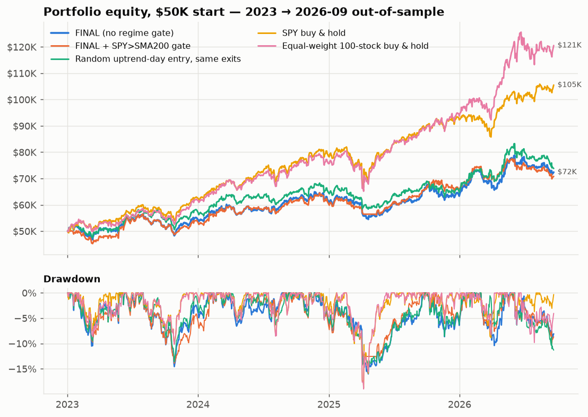
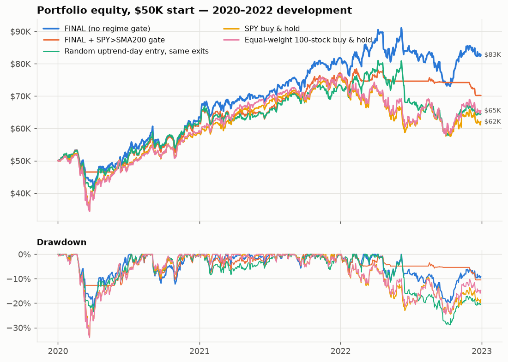

---

## 2. What was tested, and how

**Data.** Daily OHLCV from 2018 (warm-up) to 2026-09-21, split- **and** dividend-adjusted. This
cloud session had no Alpaca keys, so bars came from Yahoo's chart API. The loader uses Alpaca
(`adjustment=all`) automatically when `APCA_*` keys are present. VIX = Yahoo `^VIX`. The last two
sessions were dropped because the provider returned null bars for most stocks on 2026-09-22.
Validation (`data/meta/data_validation.csv`): no high<low bars, no open/close outside the range,
no gaps against the SPY calendar. Every extreme move was checked against real events (OXY
2020-03-09, BIIB aducanumab, ORCL 2025-09-10, NFLX 2022-04-20).

**Universe (frozen, `universe_100.csv`).** Chosen using only information available on 2019-12-31:
* Candidates were the point-in-time S&P 500 members on that date (505 names).
* Filters: 2019 median as-traded price > $10 and 2019 median dollar volume > $100M.
* Sector quotas: semis 8, software 8, other tech 5, communication 8, discretionary 10, staples 7,
  financials 12, industrials 8, transports 4, energy 7, healthcare 9, biotech 4, materials 4,
  utilities 3, REITs 3.
* Within each bucket, the most liquid names were taken. No threshold had to be relaxed.
* Result: median $490M/day, and 2019 ATR% from 1.3% to 4.1%, split into quartiles for analysis.
* Names such as TSLA (not an index member in 2019) are absent by design.

**Market layer.**
* SPY and QQQ trend: close vs SMA200, SMA50 vs SMA200, EMA20 slope.
* VIX: level, 252-day percentile, 5-day rate of change, and VIX vs its own SMA20.
* Volatility regime: SHOCK (percentile ≥ 90 or 5-day ROC ≥ +25%), HIGH (VIX ≥ 25), LOW
  (percentile ≤ 25), otherwise NORMAL.
* Breadth: % of *point-in-time* S&P 500 members above their SMA50 and SMA200, covering 94% of
  members on average.

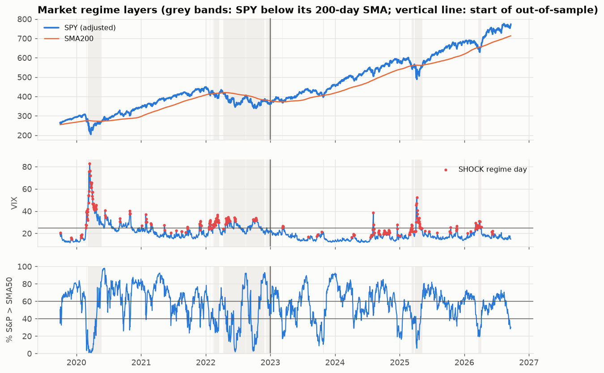

**The periods contain very different regimes.**
* Development: SPY spent 35% of days below its SMA200, and 18% of days were VIX-shock days (the
  COVID crash and the 2022 bear market).
* OOS: SPY was below its SMA200 on only 7.5% of days, with brief episodes in 2023 and the
  April-2025 tariff shock. The rest was a strong bull market.
* Any gate that only acts in bear markets therefore has little to do OOS. This is also why the
  development period was the real test of the gates.

**Execution.**
* The signal forms at the close of day T and fills at the **open of T+1**.
* Close-based exits fill at the next open.
* Stops fill intraday at the stop price, or at the open if the market gaps through it. If the entry
  open is already below the stop, the trade is skipped.
* Costs are 5 bps per side; 0 and 15 bps variants are reported.
* Development trades still open on 2022-12-30 are closed at that day's close, so no 2023 price ever
  enters a development result.
* Portfolio rules: 1% risk per trade (0.5% and 1.5% also run), position = risk$ / (entry − stop),
  ≤ 25% of equity per name, ≥ 2% minimum, gross exposure ≤ 100%. When signals exceed capital they
  are taken in random order, 10 seeds.

**Protocol.**
1. Stage 1 in development (`dev_results/dev_*.csv`): family comparison, the Strategy 0–5 ladder,
   candle types, 40 gate variants, ablation, an exit × stop grid, extension filters and
   sensitivity.
2. Stage 2 in development (`dev_results/dev_s2_*.csv`): exits and gates on the simplified entry,
   with seed-averaged portfolios and random-entry controls.
3. Selection rules were written into the code *before* stage 2 ran. The exit had to maximize dev
   Sharpe among exits with profit factor > 1.15. A regime layer was kept only if it added
   ≥ +0.10 Sharpe, did not worsen drawdown, and did not lower expectancy.
4. Freeze to `frozen_models.json` and commit.
5. Run `run_oos.py`, which only reads the frozen file.
6. Caveat: I know the broad market history of 2023–26, so some hindsight is unavoidable. The OOS
   test protects against *tuning* to that period, not against knowing about it.

**Controls (the most important addition to the original plan).**
* **Random uptrend-day entry:** enter on any day the stock passes the trend filter.
* **Random any-day entry.**
* Both use the same exits, stops and sizing as FINAL.
* A **10-session forward return** of every signal minus the average forward return of *all*
  stock-days in the same period. This measures the entry by itself, with no exit involved.

---

## 3. Does broad-market regime detection help? (Sections 9–15, 42–43)

### 3a. Gate models (FINAL entry and exit; 10-seed portfolios)

The sequence from none → SPY → +VIX → +breadth is in the top tables.
* **Development:** every added layer lowered CAGR and Sharpe: 0.91 → 0.78 → 0.62 → 0.52. The
  SPY gate did cut max drawdown from −22.6% to −14.3%.
* **OOS:** SPY-only ≈ no gate (0.62 vs 0.61). Adding VIX *hurt* (0.33). Breadth did not recover it
  (0.59).
* **Per trade, both periods:** every gate lowered expectancy. See the table below.

| Added to FINAL | Dev expectancy | OOS expectancy | Dev Sharpe | OOS Sharpe |
|:--|--:|--:|--:|--:|
| nothing (FINAL) | 0.36% | 0.60% | 0.99 | 0.68 |
| SPY > SMA200 | 0.32% | 0.54% | 0.76 | 0.69 |
| SPY SMA50 > SMA200 (on top of SPY>200) | 0.33% | 0.51% | 0.58 | 0.93 |
| VIX not in shock | 0.29% | 0.58% | 0.60 | 0.35 |
| breadth50 ≥ 40% | 0.26% | 0.62% | 0.52 | 0.64 |

*(Ablation table, 5-seed portfolios. All development gate screens are in `dev_results/dev_s2_gates.csv`,
about 27 gate definitions including QQQ.)*

### 3b. Conditional expectancy of FINAL's trades by regime (all trades, no gate applied)

| Regime at signal | Dev n | Dev exp. | OOS n | OOS exp. | Any stock-day 10d fwd (dev / OOS) |
|:--|--:|--:|--:|--:|--:|
| SPY > SMA200 & VIX low/normal | 1,599 | 0.29% | 2,684 | 0.38% | 0.11% / 0.50% |
| SPY > SMA200 & VIX high/shock | 529 | 0.26% | 241 | 0.74% | 0.87% / 0.89% |
| SPY < SMA200 & VIX low/normal | 144 | **−1.06%** | 103 | **+3.23%** | −1.48% / 1.37% |
| SPY < SMA200 & VIX high/shock | 270 | 1.69% | 103 | 3.33% | 1.41% / 2.82% |
| Market BULLISH (SPY>200, 50>200) | 2,008 | 0.31% | 2,831 | 0.43% | |
| Market MIXED (SPY>200, 50≤200) | 120 | −0.22% | 94 | −0.23% | |
| Market BEARISH (SPY<200) | 414 | 0.73% | 206 | 3.28% | |
| VIX ≤ its SMA20 (falling / calm) | 1,538 | 0.51% | 1,900 | 0.78% | |
| VIX > its SMA20 (rising) | 1,004 | 0.12% | 1,231 | 0.31% | |
| VIX 5-day change < −10% | 711 | 0.97% | 737 | 1.29% | |
| Breadth STRONG (>60%) | 1,616 | 0.11% | 1,452 | 0.29% | |
| Breadth WEAK (<40%) | 304 | 2.18% | 448 | 1.46% | |

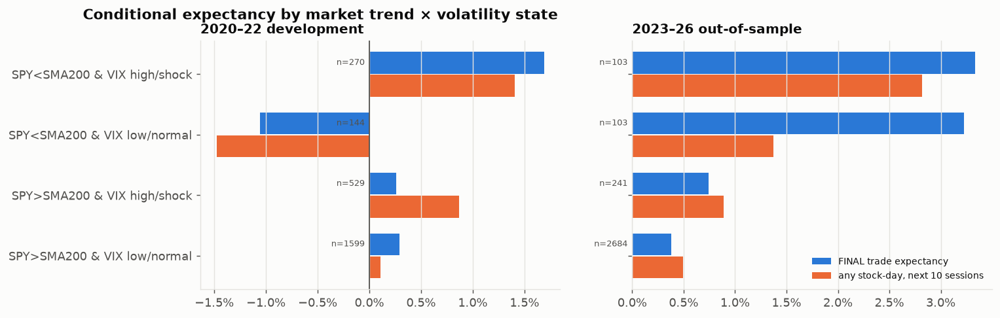

**What this shows.**
1. **The conventional reading is backwards.** A pullback-to-EMA20 buy in a stock that is *still
   in its own uptrend* while the market is weak (SPY<SMA200, high VIX, weak breadth) was the best
   trade in both periods. Those stocks are relative-strength leaders, and market stress was
   followed by rebounds (2020, 2023, April 2025). The "any stock-day" column shows the same thing
   for a random long, so it is a market effect, not a setup effect.
2. **The one sign-consistent bad cell is small.** The **MIXED** state (SPY above SMA200 but
   SMA50 ≤ SMA200, the whipsaw zone after a bear market) was −0.22% dev and −0.23% OOS. With 120
   and 94 trades this is not significant. The cell "SPY<200 & calm VIX" flipped sign from −1.06%
   to +3.23%.
3. **VIX direction is consistent; VIX level is not.** A falling VIX (below its SMA20, or a 5-day
   drop over 10%) beat a rising VIX in both periods. VIX level was inconsistent (≥30 was best in
   dev and worst in OOS, with only 31 OOS trades). This was found *after* the freeze. It suggests
   "buy when fear is receding" rather than "avoid high VIX", and must be tested on new data before
   any use.
4. **ON / REDUCED / OFF did not help.** It gave a lower Sharpe than no gate in both periods for
   every REDUCED exposure cap tested (25/50/75%: dev 0.45–0.60, OOS 0.20–0.28). Drawdown
   improved only in development.

---

## 4. The three setup families (Sections 18–28, 44)

All families use the same exit, so the entry is the only difference. "10d fwd excess" = a signal's
10-session forward return minus the average of all stock-days, which isolates the entry from the
exit.

| Family (no gate) | Dev n | Dev exp. (t) | Dev exp./day | OOS n | OOS exp. (t) | OOS exp./day | 10d fwd excess dev / OOS |
|:--|--:|--:|--:|--:|--:|--:|--:|
| A — pullback to EMA20 (simple, = FINAL) | 2,542 | 0.36% (2.8) | 0.037% | 3,131 | 0.60% (4.2) | 0.061% | −0.12% / −0.24% |
| A — full candle+volume pullback | 755 | 0.22% (1.1) | 0.020% | 974 | 0.32% (1.6) | 0.028% | −0.10% / −0.31% |
| B — failed breakdown of 20-day low | 871 | −0.30% (−2.3) | −0.097% | 986 | 0.29% (1.5) | 0.076% | −0.76% / +0.29% |
| B — EMA20 reclaim | 1,542 | 0.17% (1.1) | 0.018% | 2,013 | 0.78% (4.3) | 0.077% | −0.52% / +0.19% |
| C — volatility-contraction breakout | 113 | 1.00% (1.3) | 0.074% | 110 | 0.85% (1.3) | 0.060% | **+0.60% / +0.78%** |
| *Control: random uptrend day* | 4,911 | 0.19% (2.6) | 0.032% | 6,212 | 0.30% (3.9) | 0.052% | −0.12% / −0.12% |

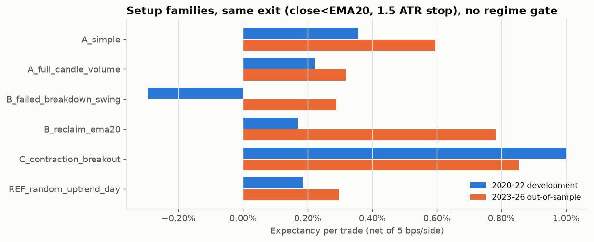

**Findings.**
* **A (pullback)** has the best-supported per-trade edge: positive and significant in both
  periods, about 2× the random-uptrend control. But its entries do **not** predict 10-day returns
  better than a random day. The edge is the combination of entry location and exit: the trade
  starts close to the EMA20 exit line, so losers are cut quickly and winners ride the EMA20.
* **B (failed breakdown)** lost money in development. Its OOS rebound is not something that could
  have been chosen in advance. The EMA20 reclaim had the best OOS portfolio (Sharpe 1.24) after
  being weak in development (0.44). **Picking it now would be out-of-sample selection**, so it
  stays a hypothesis.
* **C (contraction breakout)** is the only family whose *entry* beats a random day in both periods
  (+0.6 to +0.8 pp over 10 sessions). But it fires about 30 times a year across 100 stocks, the
  t-statistics are only 1.3, and the frozen C portfolio (with its own exit and SPY gate) fell from
  Sharpe 1.01 in dev to 0.28 OOS. It is too rare and too uncertain to stand alone, and adding it
  to FINAL lowered Sharpe in both periods.
* **By regime, per family:** every family did better in weak markets and high-VIX states than in
  calm bull states. No family needed a regime gate. The full breakdown is in
  `setup_comparison.csv` and in `qc/report_tables.md` ("Setup family × regime").

---

## 5. Do candles and volume add edge? (Sections 21–24, 50, 51)

### Strategy ladder (same exit throughout)

| Step | Dev exp. | OOS exp. | Dev exp./day | OOS exp./day | Dev / OOS 10d fwd excess |
|:--|--:|--:|--:|--:|--:|
| S0 candle only | 0.01% | 0.24% | 0.003% | 0.056% | −0.38% / −0.11% |
| S1 + stock trend | 0.37% | 0.67% | 0.039% | 0.068% | −0.19% / −0.14% |
| S2 + trigger volume ≥ 1× | 0.33% | 0.72% | 0.031% | 0.064% | −0.23% / +0.04% |
| S3 + SPY > SMA200 | 0.31% | 0.66% | 0.028% | 0.059% | −0.12% / +0.02% |
| S4 + VIX not in shock | 0.32% | 0.63% | 0.028% | 0.056% | −0.19% / 0.00% |
| S5 + breadth ≥ 40% | 0.29% | 0.66% | 0.026% | 0.058% | −0.24% / +0.01% |
| *Reference: uptrend day, no candle* | 0.19% | 0.30% | 0.032% | 0.052% | −0.12% / −0.12% |
| *Reference: any day* | 0.03% | 0.10% | 0.012% | 0.043% | 0.00% / 0.00% |

The "A" version of the ladder (the same steps plus the pullback location) falls from 0.24%/0.56%
(A1) to 0.10%/0.30% (A5) as the candle, volume and regime filters are stacked on. Full table:
`ablation_results.csv`.

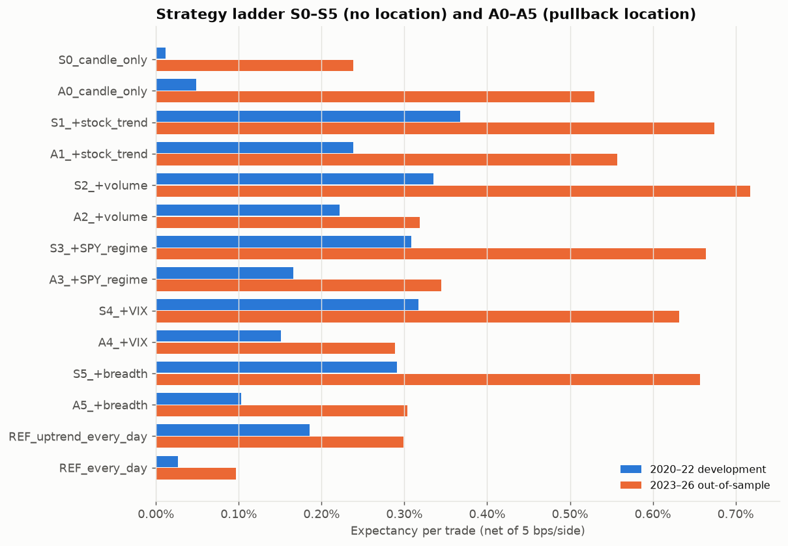

**Findings.**
* **A bullish candle on its own has no edge.** S0's 10-day forward return is 0.38 pp *below* a
  random stock-day in development.
* **The stock-trend filter is the step that adds value**: +0.36 pp dev and +0.43 pp OOS.
* **Trigger volume, SPY, VIX and breadth add nothing** after the trend step. Every row is within
  noise of S1, and per day held every row is at or below S1.

### Around FINAL: remove or add one component

| Change to FINAL | Dev exp. | OOS exp. | Verdict |
|:--|--:|--:|:--|
| (FINAL) | 0.36% | 0.60% | |
| remove the pullback location (= random uptrend day) | 0.19% | 0.30% | location earns its place per trade |
| remove the stock trend | 0.21% | 0.55% | trend helps mainly in dev (the 2022 bear market) |
| add any bullish candle | 0.35% | 0.71% | no help in dev, +0.11 pp OOS, fewer trades, lower Sharpe in both |
| add a strong close (CLV ≥ 0.75) | 0.35% | 0.74% | same |
| add a plain up-close (no shape) | 0.37% | 0.66% | as good as any candle: the shape adds nothing beyond "up day" |
| add an engulfing candle | 0.64% | 0.60% | small samples (626 / 775 trades); within noise |
| add trigger volume ≥ 1.0× / ≥ 1.5× | 0.35% / 0.28% | 0.55% / 0.49% | **hurts** |
| add pullback-volume contraction | 0.37% | 0.57% | no help |
| add extension ≤ 5% above EMA20 | 0.36% | 0.46% | **hurts OOS** |

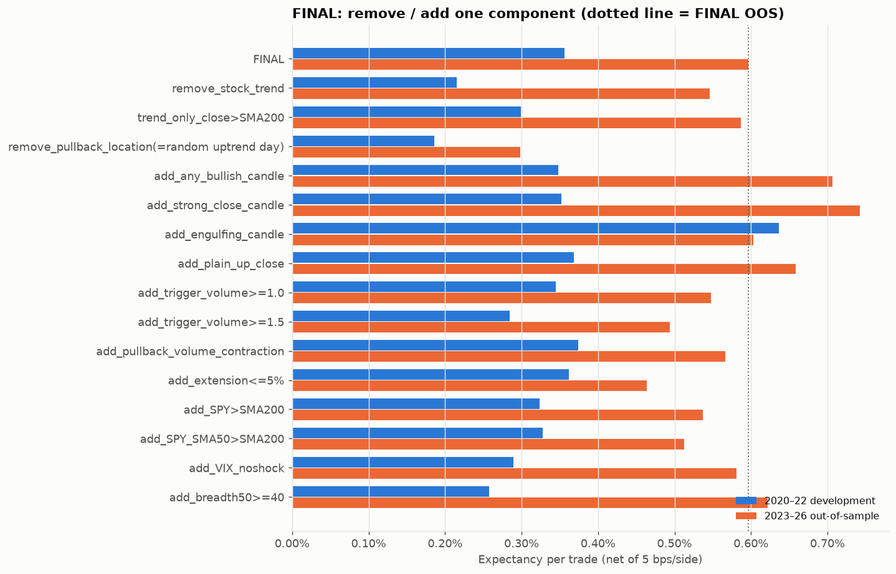

For the full hypothesis model, removing *any* single component (breadth, VIX, market gate,
trigger volume, pullback volume, candle, extension filter) left OOS expectancy the same or
**higher**. The stock-trend filter is the only exception. See `charts/ablation_hypothesis.png`.

**Conclusion.** Candle shape does not add edge beyond price location plus trend. A simple
up-close captures whatever small increment there is. Volume confirmation reduces expectancy.

---

## 6. Location, pullback depth and extension (Sections 17, 19, 20)

* **Pullback distance** (low within 1%, 2% or 3% of EMA20): 0.33 / 0.36 / 0.38% in dev and
  0.59 / 0.60 / 0.61% OOS. The result is **flat**: the exact distance doesn't matter. The strict
  "low ≤ EMA20 < close" touch rule was worse (0.16% / 0.41%).
* **Pullback depth from the 10-day high:** deeper pullbacks did better in both periods. The top
  depth quintile (> 8.2%) earned 0.97% dev and 2.03% OOS, vs 0.33% and 0.36% for the shallowest.
* **Extension:** capping extension above EMA20 at 3%, 5% or 7%, or at 1.0 or 1.5 ATR, **lowered** OOS
  expectancy (0.44–0.54% vs 0.60%). A 2-ATR cap left it unchanged (0.60%). Winners were *more* extended than losers in both
  periods. The top extension quintile earned +1.0% dev and +1.4% OOS vs −0.2% / +0.3% for the
  bottom. Avoiding extended stocks did not improve expectancy, win rate or drawdown; it removed
  momentum.
* **Pullback volume:** the pullback-volume ratio showed no separation (Q5−Q1 +0.14 / +0.47 pp, not
  monotonic).

---

## 7. Exits, stops, EMA9, giveback, MFE/MAE (Sections 30–35)

All rows are FINAL's entry with one exit or stop changed.

| Exit (1.5 ATR stop unless noted) | Dev exp. | OOS exp. | Dev / OOS exp. per day held | Hold (OOS) | Giveback % of peak (OOS) |
|:--|--:|--:|--:|--:|--:|
| A: close < EMA9 → next open | 0.10% | 0.17% | 0.02% / 0.04% | 4.3 | 63% |
| A2: two closes < EMA9 | 0.25% | 0.34% | 0.03% / 0.05% | 7.1 | 68% |
| W: EMA9 warning + confirmation | 0.16% | 0.26% | 0.03% / 0.05% | 5.6 | 65% |
| **B: close < EMA20 (frozen)** | **0.36%** | **0.60%** | 0.04% / 0.06% | 9.9 | 69% |
| C: EMA9 crosses below EMA20 | 1.03% | 1.43% | 0.05% / 0.07% | 19.4 | 70% |
| D: close < prior 10-day low | 0.83% | 1.01% | 0.05% / 0.06% | 16.8 | 72% |
| E: price/volume deterioration or EMA20 | 0.29% | 0.51% | 0.03% / 0.06% | 8.9 | 69% |
| F: 2-ATR stop + 3-ATR chandelier | 0.84% | 0.84% | 0.05% / 0.05% | 16.3 | 74% |
| Fixed 10 / 20 sessions | 0.41% / 0.72% | 0.44% / 1.15% | 0.04%/0.04% · 0.04%/0.06% | 10 / 20 | 64% / 66% |

| Initial stop (EMA20 exit) | Dev exp. | OOS exp. | Avg MAE (OOS) |
|:--|--:|--:|--:|
| none | 0.39% | 0.65% | −2.6% |
| 1.0 ATR | 0.32% | 0.50% | −1.8% |
| **1.5 ATR (frozen)** | 0.36% | 0.60% | −2.2% |
| 2.0 ATR | 0.37% | 0.64% | −2.4% |
| signal-candle low | 0.27% | 0.47% | −1.4% |
| 5-day swing low | 0.37% | 0.66% | −2.2% |

**Findings.**
* **Giveback is structural.** Every exit gives back **60–75%** of the best closing gain, because
  the median trade peaks at only a few percent before reversing.
* **Faster exits cut giveback but cut expectancy more.** EMA9 exits have the lowest giveback and
  the lowest expectancy.
* **EMA9 works better as a warning than as an exit.** The order was immediate < warning+confirm <
  two closes < EMA20. None beat the plain EMA20 exit.
* **Slower exits look better per trade but not per day.** EMA cross, swing low and chandelier exits
  gain per trade only by holding 2–3× longer. Per day held they are all 0.04–0.07%, which is about
  the market's drift. **No exit family preserves profit meaningfully better per unit of time.**
* **Hard stops don't add expectancy.** They reduce MAE only. The tight signal-candle-low stop is
  the worst.
* **MFE/MAE:** average OOS MFE +5.4% and MAE −2.2%. Winners average +7.4% and losers −2.5% at the
  portfolio level. A 30% win rate is carried by a fat right tail (below).

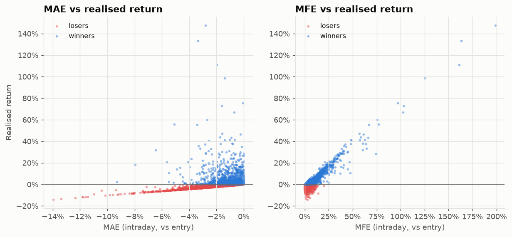

---

## 8. Portfolio construction (Sections 36–39)

| FINAL, OOS | CAGR | Max DD | Sharpe | Exposure | Avg / max positions | Avg / peak capital deployed |
|:--|--:|--:|--:|--:|--:|--:|
| 0.5% risk, 5 bps | 9.2% | -16.3% | 0.66 | 96% | 8.2 / 13 | $57.9K / $76.4K |
| **1.0% risk, 5 bps** | 9.8% | -20.1% | 0.61 | 97% | 5.2 / 8 | $58.5K / $82.0K |
| 1.5% risk, 5 bps | 10.5% | -20.5% | 0.62 | 97% | 4.4 / 6 | $59.4K / $86.4K |
| 1.0% risk, 0 bps | 13.0% | -18.3% | 0.78 | 97% | 5.2 / 8 | |
| 1.0% risk, **15 bps** (with stop slippage) | 5.3% | -21.5% | 0.37 | 97% | 5.2 / 8 | |

(Development: 14.4% / 17.9% / 22.9% CAGR at 0.5 / 1 / 1.5% risk. Full grid in `portfolio_results.csv`.)

* **Costs decide the outcome.** Each trade lasts about 10 sessions and the portfolio turns over
  roughly 125 positions a year. Moving from 5 to 15 bps per side halves OOS CAGR.
* **More risk per trade barely helps**, because the 25% single-name cap and the 100% gross cap
  bind. At 1% risk (a 1.5-ATR stop is about 3.3% of price at the median signal) a full-risk position
  would be about 30% of equity, so most positions hit the 25% cap.
* **The strategy is almost always fully invested (93–97%)** yet earns well under buy-and-hold. It
  holds ~5 concentrated, frequently-rotated positions instead of 100 names, and gives back about
  70% of each trade's peak.

---

## 9. Breadth of results across the 100 stocks (Sections 45–47, 54)

Per-stock test: $10K per stock, fully invested on each signal, one position at a time. Compared
with buy-and-hold of the *same* stock.

| | Dev | OOS |
|:--|--:|--:|
| Stocks profitable | 55% | 53% |
| Stocks with positive expectancy | 62% | 59% |
| Stocks beating their own buy-and-hold | 26% | **18%** |
| Stocks with a better Sharpe than buy-and-hold | 28% | **10%** |
| Stocks with a smaller max drawdown than buy-and-hold | 92% | 78% |
| 25th / 50th / 75th percentile total return | −11% / +4% / +23% | −13% / +2% / +29% |
| Median buy-and-hold return of the same stocks | +27% | +69% |

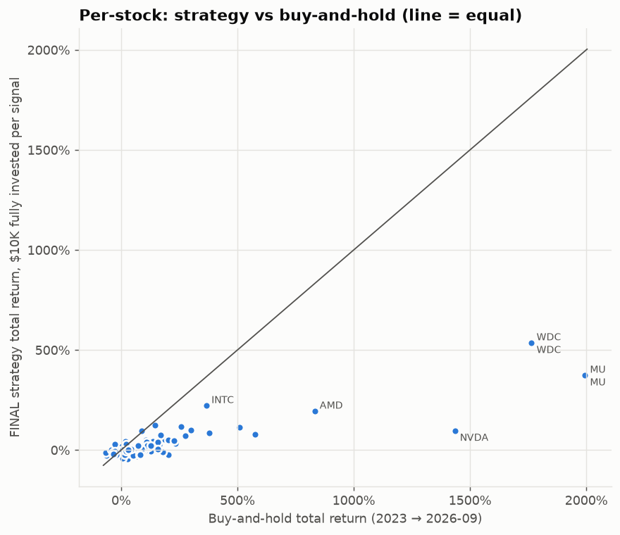

**Profit concentration: flagged.**
* **OOS, the top 5 stocks (WDC, MU, INTC, AMD, NFLX) made 61% of net profit.** The top 10 made 84%,
  and the top 20 made **109%**, so the other 80 stocks lost money in aggregate.
* Development looks the same: the top 5 (LLY, COP, OXY, MPC, EOG) made 51%, and the top 20 made 127%.
* The strategy works as a momentum net that catches whichever sector is running. It is not an edge
  that generalizes stock by stock.

**Stock volatility (the most consistent separator).** Per-trade expectancy rises with volatility
in both periods:

| 2019 ATR% bucket | Dev exp. | OOS exp. |
|:--|--:|--:|
| Low (1.3–1.7%) | −0.02% | 0.00% |
| Medium (1.7–2.0%) | 0.28% | 0.29% |
| High (2.0–2.2%) | 0.46% | 0.57% |
| Very high (2.3–4.1%) | 0.75% | 1.57% |

Signal-day ATR% quartiles show the same pattern: Q1 −0.11% / 0.15%, Q4 0.90% / 1.33%.
**Low-volatility names (staples, utilities, REITs, big pharma) are unsuitable.** Moves of about
2–3% are too small relative to a 1.5-ATR stop, the EMA20 exit and costs. This is post-hoc, so it
should be confirmed on new data before being used as a filter.

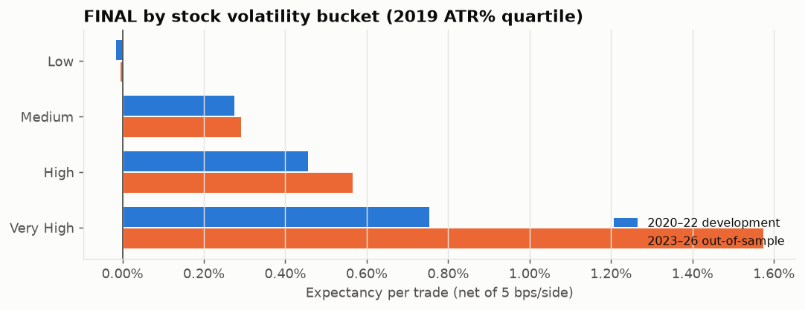

**Sector.** Results do not generalize across periods.
* The best sectors flip with market leadership: Energy +1.96% and Software +1.22% in dev, then
  Semis +3.00% and Tech hardware +2.72% in OOS.
* Energy went from best in dev to negative OOS (−0.18%).
* Consistently weak in both periods: **Biotech (−0.12% / −0.18%), Utilities (−0.45% / +0.03%),
  Real Estate (−0.25% / +0.03%)**.
* Per-sector drawdowns are in `sector_results.csv`.

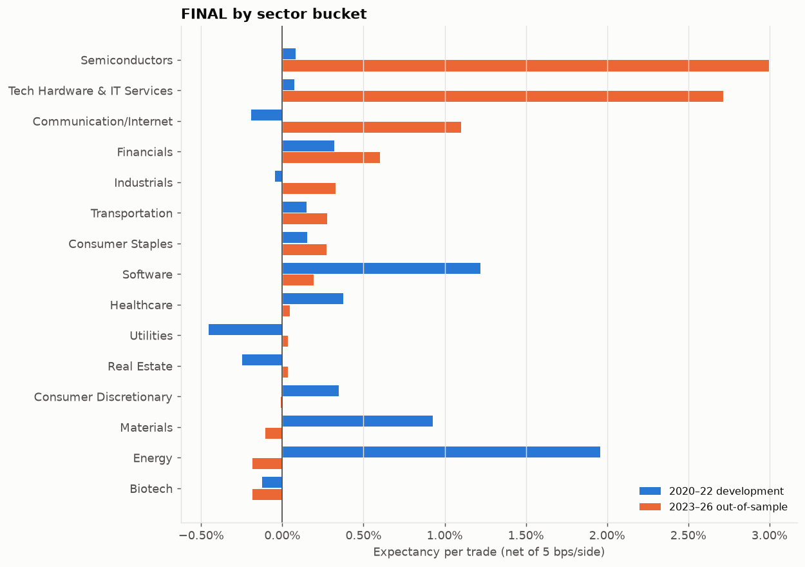

---

## 10. Winners vs losers (Section 48)

Quintile edges were fixed on development trades and applied unchanged to OOS.

| Feature at signal | Q5 − Q1 expectancy, dev | OOS | Consistent? |
|:--|--:|--:|:--|
| Stock ATR% | +0.81 pp | +2.52 pp | **yes: higher volatility is better** |
| Extension above EMA20 | +1.19 pp | +1.17 pp | **yes: more extended is better** |
| Pullback depth from 10-day high | +0.64 pp | +1.67 pp | **yes: deeper is better** |
| 20-day return | +0.60 pp | +1.61 pp | **yes: momentum** |
| VIX 5-day change | −1.10 pp | −1.09 pp | **yes: a falling VIX is better** |
| Candle close location (CLV) | +0.09 pp | +0.46 pp | no signal |
| Candle body fraction | +0.03 pp | +0.46 pp | no signal |
| Signal range / ATR | −0.39 pp | −0.27 pp | no signal |
| Trigger volume ratio | −0.61 pp | +0.26 pp | inconsistent |
| Pullback volume ratio | +0.14 pp | +0.47 pp | no signal |
| Breadth (% > SMA50) | −0.89 pp | −0.24 pp | weak breadth slightly better |
| VIX level | +1.66 pp | −0.68 pp | inconsistent |

The candle-geometry and volume features carry **no information** about outcomes. The useful
features are about the stock's momentum and volatility and the market's fear *trend*. All of these
were found after the freeze, so they are hypotheses for a new study, not rules.

---

## 11. Parameter robustness (Section 49)

| Parameter | Values tested (★ = frozen) | Dev expectancy | OOS expectancy |
|:--|:--|:--|:--|
| Pullback distance | 1% / ★2% / 3% | 0.33 / 0.36 / 0.38% | 0.59 / 0.60 / 0.61% |
| Stock trend | >SMA200 / +SMA50>200 / ★+EMA20 rising | 0.30 / 0.29 / 0.36% | 0.59 / 0.51 / 0.60% |
| ATR stop | 1.0 / ★1.5 / 2.0 | 0.32 / 0.36 / 0.37% | 0.50 / 0.60 / 0.64% |
| Trigger volume | ★none / 1.0 / 1.2 / 1.5 | 0.36 / 0.35 / 0.28 / 0.28% | 0.60 / 0.55 / 0.59 / 0.49% |
| Strong-close CLV (added) | 0.70 / 0.75 / 0.80 | 0.39 / 0.35 / 0.24% | 0.72 / 0.74 / 0.77% |

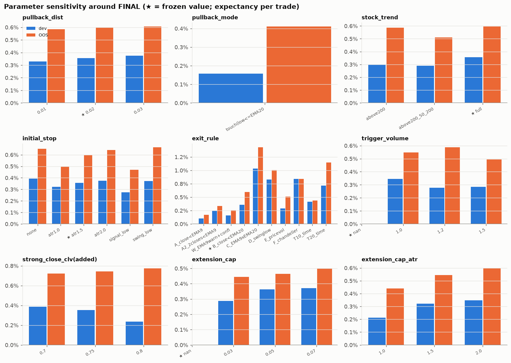

**Per-trade results are smooth; portfolio results are not.**
* FINAL's per-trade result is stable across nearby parameters. No knife-edge optimum was found.
* The full hypothesis model does *not* show that stability. Its dev expectancy of 0.10% (t = 0.5)
  is indistinguishable from zero, and removing any single component moves it anywhere from −0.12%
  to +0.22%.
* The ~3-seed portfolio Sharpe in `parameter_sensitivity.csv` ranges 0.38–0.86 across pullback
  distances of 1–3%, whose trade lists are nearly identical. That is allocation noise, not parameter sensitivity.

---

## 12. Case studies (Section 55)

All picks were made by rule in `src/charts.py`, not by eye.

| Case | Trade | What happened |
|:--|:--|:--|
| Strong winner (97.5th percentile OOS) | EBAY, signal 2024-07-29, +19.1% in 58 sessions | Uptrend, pullback low near EMA20, 1.6% above EMA20 at the signal, VIX 16.6. The trend ran for three months. MFE was +24.7%; the EMA20 exit gave back 5.6 pp from the intraday peak after the October roll-over. |
| Normal winner (median winner OOS) | T, 2023-01-04, +3.2% in 22 sessions | MFE +14.1% but exited at +3.2%. A typical case of giving back most of the peak. |
| False signal (median loser OOS) | XOM, 2026-09-01, −2.1% in 3 sessions | Entered 3.4% above EMA20 after touching it. Closed below EMA20 three days later. Typical loser: small and fast. |
| Regime filter prevented a loss | JNJ, 2025-03-31, −2.4% | Signal two days before the April-2025 tariff crash (SPY<SMA200, VIX shock). Stopped out the next session. The SPY gate would have skipped it. |
| Regime filter missed a winner | CRM, 2023-03-13, +5.6% | Signal during the SVB stress (SPY<SMA200, VIX shock, breadth 18%). CRM kept its own uptrend and ran. The SPY gate would have skipped it. |
| Cost/benefit of the SPY gate (aggregate) | 414 dev + 206 OOS blocked trades | Blocked trades averaged **+0.73% (dev) and +3.28% (OOS)**, vs +0.28% / +0.41% for allowed trades. On net the filter removed the best trades. |

Charts: `charts/case_strong_winner.png`, `case_normal_winner.png`, `case_false_signal_loser.png`,
`case_regime_prevented_loss.png`, `case_regime_missed_winner.png`.

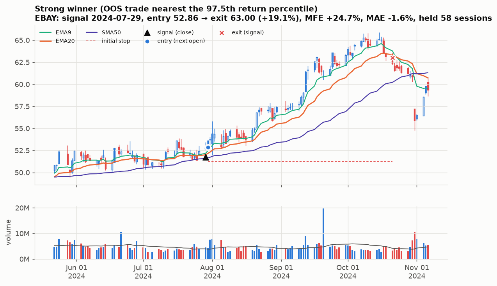

---

## 13. Quality control and audit (Section 59)

* **Look-ahead test** (`src/lookahead_check.py`): 346 sampled (stock, day) points. At each point
  every feature and all five setup signals were recomputed from history truncated at that day, and
  the same was done for SPY/QQQ trend, VIX percentile and ROC, and breadth. **0 mismatches**
  (`qc/lookahead_check.csv`).
* **Manual audit** (`src/audit.py` → `qc/audit_report.md`): 8 FINAL trades (dev and OOS, stop and
  signal exits) were recomputed with plain-Python loops from raw bars. **136/136 checks pass.**
  The checks cover:
  * trend and pullback qualification, EMA20, ATR
  * entry = the next session's open, the stop, exit date/price/reason, net return
  * MFE, MAE, peak close and giveback
  * SPY vs SMA200 and SMA50, VIX, and breadth at the signal date
* **Independent adversarial code review** (a fresh-context agent) found no look-ahead in signals,
  the engine or the portfolio. It verified on about 16k trades that:
  * entry is always the signal bar + 1
  * no stock ever has overlapping positions
  * no exit falls past the period end
  * portfolio cash never goes negative, and ending equity equals capital + Σ P&L exactly

  It found one real bug: the reused-ticker guard dropped spin-offs such as CARR, OTIS, GEHC and
  CEG from breadth. **Fixed.** Breadth moved by ≤ 0.78 pp; the breadth ≥ 40% gate changed on 4 of
  1,688 days; the universe is unchanged (same hash); FINAL is unaffected. `dev_results/` predates
  the fix; all REPORT numbers come from the post-fix `run_oos.py`.
* **Execution-model caveats** raised by the review:
  * Sizing uses the fill-day open, which a real market-on-open order wouldn't know yet (small effect).
  * Stops fill exactly at the stop price. The 15 bps-per-side run shows what slippage does.
* **A design weakness found in the audit.** The frozen "low within 2% of EMA20 in the last 5
  sessions" rule can admit a stock that touched EMA20 and then gapped far above it. Example: GILD
  on 2020-04-16 entered +13.7% above EMA20 on remdesivir news. It was left unchanged because it was
  frozen. The extension-cap variants show that capping it would have *lowered* returns.

---

## 14. Limitations

1. **Survivorship.** 56 of the 505 members on 2019-12-31 have no usable price history, so they
   could not be selected. They were acquired, failed or went private — for example ATVI, TWTR,
   XLNX, AGN, ALXN, PXD, HES, SIVB, FRC and WBA — or are 2019 spin-offs without a full 2019
   history (DOW, CTVA, FOX). The reviewer estimates 2–3 of them (TWTR, AGN, perhaps ATVI) would
   have made the liquidity cut. Direction of bias: unclear. The equal-weight benchmark shares it.
2. **GICS labels are current (2026).** V, MA, PYPL and FIS count as Financials because of the 2023
   reclassification. Under 2019 labels about 4 of the 100 names would change. This uses later
   information about labels, not about returns.
3. **Provider.** Yahoo is used instead of Alpaca. Adjustment conventions match
   (split + dividend). The optional FRED VIX cross-check could not run because FRED timed out.
4. **Regime mix.** The OOS period is 92.5% SPY-above-SMA200. It tests gates weakly and heavily
   favors buy-and-hold. The development period carried most of the bear-market evidence against
   the gates.
5. **Statistical power.** Portfolio Sharpe differences below ~0.3 are within allocation noise.
   Setup C has only about 110 trades per period.
6. **Unavoidable hindsight.** I know what markets did in 2023–26 in broad terms. The protocol
   prevents tuning to that period, not knowing about it.

---

## 15. FINAL MODEL

The single primary framework frozen from development and unchanged OOS. It is the most defensible
thing this study produced, but it **did not beat buy-and-hold or random entry on a risk-adjusted
basis out-of-sample.** Treat it as a forward-test candidate, not a proven edge.

## MARKET GATE

None. SPY>SMA200, SMA50>SMA200, EMA20 slope and QQQ>SMA200 were tested. None improved expectancy in
either period. Trades in bearish markets were the best trades.

## VOLATILITY GATE

None. VIX level, percentile and shock filters removed profitable trades. (Post-hoc observation to
test separately: entries while VIX is *falling* — below its 20-day SMA — did better in both periods.)

## BREADTH GATE

None. Breadth (% of S&P members above SMA50/SMA200) added nothing beyond SPY + VIX, and weak-breadth
entries did better.

## STOCK TREND

Close > SMA200, SMA50 > SMA200, and EMA20 higher than 5 sessions ago.

## SETUP

At least one daily low in the last 5 sessions (including today) came within 2% of EMA20 (or
below it), **and** today's close is above EMA20.

## CANDLE CONFIRMATION

None. Candle shape added nothing beyond price location. A plain up-close was as good as any
defined candle.

## VOLUME CONFIRMATION

None. Trigger-volume thresholds of 1.0×, 1.2× and 1.5× and pullback-volume contraction all lowered
or failed to raise expectancy.

## ENTRY

Signal at today's close. Buy at the **next session's open**.

## INITIAL RISK

Stop = entry − 1.5 × ATR14 (Wilder ATR from the signal day). Size = 0.5–1% of equity at risk /
(entry − stop), capped at 25% of equity per name, gross exposure ≤ 100%. If the open is already
below the stop, don't enter.

## HOLD

Hold while every close stays above EMA20 and the stop is not hit. Median hold was 4–5 sessions
and the mean about 10. About 20% of trades end at the stop.

## EARLY WARNING

A close below EMA9 is information only. Acting on it (immediately, after two closes, or with a
bearish-candle/volume confirmation) lowered expectancy in both periods. Take no action.

## EXIT

First close below EMA20 → sell at the next open. Or the 1.5-ATR stop is hit intraday.

## RE-ENTRY

Allowed on the next valid signal after the exit, with no cooldown. The same rules apply from
scratch.

**Paper-trade protocol (so the forward test can actually falsify the model).**
* Run it exactly as above on this frozen `universe_100.csv`.
* Run alongside it, in shadow: (a) SPY buy-and-hold and (b) a random uptrend-day entry with the
  same exits and sizing.
* Record fill slippage on stops.
* **Kill criteria, after about 150 trades:** stop the forward test if either condition holds.
  * Per-trade expectancy net of real costs is ≤ +0.2%.
  * The random-entry shadow matches it on return per day held.
* **Do not deploy capital** unless it beats SPY buy-and-hold's Sharpe over at least 12 months,
  which it did not do in any OOS year of this backtest.

---

## 16. Answers to the final questions (Section 57)

1. **Does broad-market regime detection materially improve this strategy?** **No.** Every SPY,
   VIX, breadth and ON/OFF gate lowered per-trade expectancy in both periods. The SPY gate cut
   development drawdown (−22.6% → −14.3%) but cost more return than it saved (Sharpe
   0.91 → 0.78). OOS it made no difference (0.61 vs 0.62). Blocked trades were the best trades.
2. **Is SPY > SMA200 sufficient, or does 50/200 add value?** Neither adds value. 50/200 on top of
   SPY>200 did not pass the development keep rule (Setup C: +0.09 Sharpe; FINAL: lower). It was
   inconsistent OOS (FINAL Sharpe 0.58 dev → 0.93 OOS). If a market gate is imposed anyway,
   SPY>SMA200 alone is as good as any combination tested.
3. **Does VIX improve trade selection?** **Not as a gate.** Every VIX gate lowered expectancy, and
   SPY + VIX was the second-worst OOS variant (Sharpe 0.33). High-VIX entries did *better*.
4. **Is VIX level or VIX rate-of-change more useful?** **Rate of change or direction.** Falling VIX
   (a 5-day drop over 10%, or VIX below its SMA20) was better in both periods. The Q1−Q5 gap of the
   5-day VIX change was −1.1 pp in both periods. Level was inconsistent. This is post-hoc and
   untested as a rule.
5. **Does market breadth add incremental edge beyond SPY + VIX?** **No.** Breadth ≥ 40% on top of
   SPY + VIX: dev 0.62 → 0.52 Sharpe; OOS it partly recovered the VIX damage but stayed below no
   gate. Weak breadth (< 40%) had the *best* trade expectancy in both periods.
6. **Should the strategy have ON / REDUCED / OFF states?** **No.** It was the worst regime variant
   OOS (Sharpe 0.20 vs 0.61), below no gate in development (0.49 vs 0.91), and lower than no gate
   for every REDUCED cap tested (25/50/75%).
7. **When should new long trades be completely disabled?** The evidence supports **no
   regime-based shutdown** for this setup. The only sign-consistent weak state was
   SPY>SMA200 with SMA50≤SMA200 (MIXED, −0.2% in both periods), but that rests on 94–120 trades,
   so it is not a basis for a rule. Protect capital with position-level stops, the gross-exposure
   cap and an account-level drawdown circuit breaker, not with market-regime switches.
8. **Which candlestick setup has the strongest out-of-sample expectancy?**
   * By OOS number alone: the **EMA20 reclaim** (0.78%, t = 4.3) and **contraction breakout**
     (0.85%, t = 1.3). The reclaim failed in development and the breakout is statistically weak.
   * The only setup that is positive and significant in **both** periods is the **pullback to
     EMA20 with no candle requirement** (0.36% → 0.60%, t = 4.2).
   * No candle *shape* setup (engulfing, hammer, wide-range, strong close) was robustly better.
     Hammers were negative in development.
9. **Does volume confirmation materially improve candle signals?** **No.** It reduced expectancy
   and trade count in both periods: ≥ 1.5× went 0.36 → 0.28% dev and 0.60 → 0.49% OOS.
10. **Is declining volume during the pullback useful?** **No.** 0.37% vs 0.36% dev and 0.57% vs
    0.60% OOS. Winners and losers had the same pullback-volume ratio.
11. **What trigger-volume increase is useful?** **None** of 1.0×, 1.2× or 1.5×. Higher thresholds
    were monotonically worse per day held.
12. **What pullback depth is best?** The distance to EMA20 (1–3%) is irrelevant; results are
    flat. A deeper pullback from the 10-day high was better in both periods (top quintile, > 8%),
    but that is post-hoc.
13. **Does avoiding extended stocks improve outcomes?** **No, the opposite.** Every extension cap
    lowered OOS expectancy or left it unchanged (2 ATR), and more-extended entries did better in
    both periods.
14. **Which stock-volatility range is most suitable?** **Higher volatility.** The low-volatility
    quartile (ATR < ~1.7%) had zero expectancy in both periods. The very-high quartile
    (ATR 2.3–4%) was best (0.75% / 1.57%). Moderate-to-high, not low, is the answer.
15. **Which exit framework best preserves profits?** **None does it well.** Giveback was 60–75% of
    peak for every exit. Close < EMA20 is the best balance per trade among fast exits. Slower
    exits (EMA9×EMA20 cross, swing low) earn more per trade but the same per day held. Using EMA9
    as an immediate exit is the worst choice.
16. **Does the strategy work across most of the 100 stocks?** **Barely.** 53–55% of stocks were
    profitable and 59–62% had positive expectancy, but only 18% (OOS) beat their own buy-and-hold
    and 10% had a better Sharpe.
17. **Are profits concentrated in only a few stocks?** **Yes, heavily.** OOS, the top 5 stocks made
    61% of net profit and the top 20 made 109%. Development: 51% and 127%.
18. **Which sectors work best / worst?** Best: whichever sector is leading (Energy and Software in
    2020–22; Semis, Tech hardware and Communication in 2023–26), so sector leadership isn't
    predictable from this setup. Worst in both periods: Biotech, Utilities and Real Estate.
19. **Does it outperform buy-and-hold on a risk-adjusted basis?** **No, out-of-sample.** Sharpe
    0.61 vs 1.42 for SPY and 1.55 for the equal-weight 100. It did beat buy-and-hold in 2020–22
    (0.91 vs 0.41–0.48), with a smaller drawdown (−22.6% vs −34%).
20. **What exact strategy should be paper traded next?** FINAL as specified in section 15: uptrend
    + pullback to EMA20 + close above EMA20, next-open entry, 1.5-ATR stop, exit on the first close
    below EMA20, no regime/candle/volume filters. It should be run strictly as a falsification test
    with the shadow benchmarks and kill criteria above.
    * **Honest recommendation:** this study found no strategy worth risking capital on over buying
      the index.
    * The more promising direction is a **new, separately validated** study built from the
      post-hoc findings: prefer higher-ATR% stocks, don't avoid extension, and enter as fear
      recedes (VIX falling) rather than gating on its level. It needs a fresh holdout before any
      paper trading.

---

### Files

| File | Contents |
|:--|:--|
| `universe_100.csv` | frozen universe with sector, industry, 2019 price / $ volume / ATR% / realized volatility, history, inclusion reason |
| `frozen_models.json` | every frozen model, ladder rung, ablation and sensitivity variant, with provenance |
| `trades.csv` | every trade (FINAL, SPY-gated, full hypothesis, Setup C; dev and OOS) with signal features and regime at signal |
| `portfolio_results.csv` | 10-seed portfolio statistics: all models, risk and cost grid, exposure-cap variants, benchmarks |
| `setup_comparison.csv` | families × gating × regime slice |
| `ablation_results.csv` | Strategy 0–5 ladders, ablation of the full hypothesis model and of FINAL |
| `parameter_sensitivity.csv` | one-at-a-time sensitivity around FINAL |
| `regime_results.csv` | conditional expectancy by 12 regime dimensions and combinations |
| `per_ticker_results.csv`, `per_ticker_summary.csv` | per-stock strategy vs buy-and-hold |
| `volatility_results.csv`, `sector_results.csv`, `concentration_results.csv` | Sections 45–47 |
| `winners_losers_analysis.csv` | feature means and dev-fixed quintile expectancy |
| `dev_results/` | all development-period evidence behind the freeze |
| `qc/` | look-ahead test, manual audit, case-study picks, every report table (`report_tables.md`) |
