# RubberBandBot System Architecture & Data Flow

This document provides a comprehensive analysis of the RubberBandBot system architecture, focusing on the data flow between the four trading bots, shared internal components, and external services.

## System Overview

The RubberBandBot ecosystem consists of **four distinct trading bots** that run independently but share a common core of utility modules for data fetching, execution, state management, and logging.

### The 4 Bots
1.  **15m Stock Bot** (`15M_STK`): Intraday mean reversion on stocks (15-minute candles).
2.  **15m Options Bot** (`15M_OPT`): Intraday bull call spreads on stocks (15-minute candles).
3.  **Weekly Stock Bot** (`WK_STK`): Weekly mean reversion on stocks (Daily data resampled to Weekly).
4.  **Weekly Options Bot** (`WK_OPT`): Weekly signal trading 45-DTE ITM Calls.

### Key Data Flows
*   **Data Ingestion**: All bots consume market data (Bars, Quotes, Option Chains) via the **Alpaca Data API**.
*   **State Management**: Position ownership is tracked locally via the **Position Registry** (JSON files) to distinguish which bot owns which position in the shared Alpaca account.
*   **Execution**: Trade orders are routed to the **Alpaca Trading API**.
*   **Resilience**: A shared **Ticker Health** system monitors consecutive losses to trigger circuit breakers.

## Data Flow Diagram

**Note:** This diagram is written in [Mermaid](https://mermaid.js.org/). 
- **VS Code:** Install "Mermaid Preview" or "Markdown Preview Mermaid Support" extensions to view it.
- **Online:** Copy the code block below and paste it into the [Mermaid Live Editor](https://mermaid.live/).

```mermaid
graph TD
    %% Styles
    classDef bot fill:#f9f,stroke:#333,stroke-width:2px,color:black;
    classDef ext fill:#ddd,stroke:#333,stroke-width:1px,color:black,stroke-dasharray: 5 5;
    classDef shared fill:#add8e6,stroke:#333,stroke-width:1px,color:black;
    classDef storage fill:#ffdfba,stroke:#333,stroke-width:1px,color:black;

    subgraph External_Services [External Services]
        AlpacaData[("Alpaca Data API\n(Bars, Quotes, Chains)")]:::ext
        AlpacaTrade[("Alpaca Trading API\n(Orders, Positions)")]:::ext
    end

    subgraph Storage [Local Persistence]
        Config["Config Files\n(config.yaml, tickers.txt)"]:::storage
        RegistryJSON["Position Registry JSONs\n(.position_registry/*.json)"]:::storage
        HealthJSON["Ticker Health JSON\n(ticker_health.json)"]:::storage
        Logs["Logs & Results\n(results/*.jsonl)"]:::storage
    end

    subgraph Shared_Core [Shared Core Modules]
        DataMod["src/data.py\n(Market Data & Order Wrappers)"]:::shared
        OptDataMod["src/options_data.py\n(Option Chains & Greeks)"]:::shared
        RegistryMod["src/position_registry.py\n(State Tracking)"]:::shared
        HealthMod["src/ticker_health.py\n(Circuit Breaker)"]:::shared
        LoggerMod["src/trade_logger.py\n(Structured Logging)"]:::shared
    end

    subgraph Bots [Trading Bots]
        Bot15Stk(15m Stock Bot\nlive_paper_loop.py):::bot
        Bot15Opt(15m Options Bot\nlive_spreads_loop.py):::bot
        BotWkStk(Weekly Stock Bot\nlive_weekly_loop.py):::bot
        BotWkOpt(Weekly Options Bot\nlive_weekly_options_loop.py):::bot
    end

    %% Configuration Flow
    Config --> Bot15Stk
    Config --> Bot15Opt
    Config --> BotWkStk
    Config --> BotWkOpt

    %% Data Fetching Flow
    Bot15Stk -- Fetch Bars --> DataMod
    Bot15Opt -- Fetch Bars --> DataMod
    BotWkStk -- Fetch Bars --> DataMod
    BotWkOpt -- Fetch Bars --> DataMod

    Bot15Opt -- Fetch Option Chains --> OptDataMod
    BotWkOpt -- Fetch Option Chains --> OptDataMod

    DataMod -- HTTP GET --> AlpacaData
    OptDataMod -- HTTP GET --> AlpacaData

    %% Execution Flow
    Bot15Stk -- Submit Brackets --> DataMod
    Bot15Opt -- Submit Spreads --> DataMod
    BotWkStk -- Submit Brackets --> DataMod
    BotWkOpt -- Submit Options --> DataMod

    DataMod -- HTTP POST/DELETE --> AlpacaTrade

    %% State & Sync Flow
    AlpacaTrade -- "Get Positions/Fills (Sync)" --> DataMod
    DataMod --> Bot15Stk
    DataMod --> Bot15Opt
    DataMod --> BotWkStk
    DataMod --> BotWkOpt

    Bot15Stk -- "Read/Write State" --> RegistryMod
    Bot15Opt -- "Read/Write State" --> RegistryMod
    BotWkStk -- "Read/Write State" --> RegistryMod
    BotWkOpt -- "Read/Write State" --> RegistryMod

    RegistryMod <--> RegistryJSON

    %% Health & Resilience Flow
    Bot15Stk -- Check/Update Health --> HealthMod
    HealthMod <--> HealthJSON

    %% Logging Flow
    Bot15Stk -- Log Events --> LoggerMod
    Bot15Opt -- Log Events --> LoggerMod
    BotWkStk -- Log Events --> LoggerMod
    BotWkOpt -- Log Events --> LoggerMod
    LoggerMod --> Logs
```

## Component Details

### 1. Data Ingestion Layer
*   **`src/data.py`**: The primary gateway for stock data. It handles pagination, RTH (Regular Trading Hours) filtering, and error handling for fetching bars (`fetch_latest_bars`). It also provides wrappers for execution like `submit_bracket_order`.
*   **`src/options_data.py`**: A specialized module for options. It fetches option chains (`fetch_option_contracts`), selects ATM/ITM contracts, and retrieves real-time Greeks snapshots (`get_option_snapshot`).

### 2. State Management (The Registry)
*   **Problem**: A single Alpaca account is shared by 4 bots. Alpaca's API returns *all* positions mixed together.
*   **Solution**: `src/position_registry.py`.
    *   **Mechanism**: Each bot generates a prefixed `client_order_id` (e.g., `15M_STK_...`).
    *   **Persistence**: Stores local JSON files (e.g., `.position_registry/15M_STK_positions.json`) tracking which symbol belongs to which bot.
    *   **Synchronization**: On every loop, bots call `registry.sync_with_alpaca()` to reconcile local state with actual broker state (removing closed positions).

### 3. Execution & Risk
*   **Orders**: Most bots use **Bracket Orders** (Entry + Take Profit + Stop Loss) where supported (Stocks). Option bots manage exits manually via logic loops (`manage_positions`) because complex multi-leg exits (spreads) are often managed manually or via custom logic rather than broker-side brackets.
*   **Kill Switch**: `check_kill_switch` in `src/data.py` calculates the daily PnL (Realized + Unrealized) and halts the bot if losses exceed a defined percentage (default 25%) of invested capital.
*   **Circuit Breaker**: `src/ticker_health.py` tracks consecutive losses per ticker. If a ticker hits 3 consecutive losses, it is "paused" (probation) for 7 days to prevent fighting a losing trend.

### 4. Bot Specifics

| Feature | 15m Stock | 15m Options | Weekly Stock | Weekly Options |
| :--- | :--- | :--- | :--- | :--- |
| **Logic** | Intraday Mean Rev | Intraday Mean Rev | Weekly Mean Rev | Weekly Mean Rev |
| **Asset** | Stock (Equity) | Options (Spreads) | Stock (Equity) | Options (Calls) |
| **Entry** | RSI < 30, Bollinger | RSI < 30, Bollinger | RSI < 45, Price < SMA | RSI < 45, Price < SMA |
| **Exit** | Bracket (TP 1.5R) | Logic (TP 80%, SL -50%) | Bracket (TP 2.5R) | Logic (TP 100%) |
| **State** | Registry + Alpaca | Registry + Alpaca | Registry + Alpaca | Registry + Alpaca |
| **Timeframe**| 15 Minute | 15 Minute | Weekly (Resampled) | Weekly (Resampled) |
